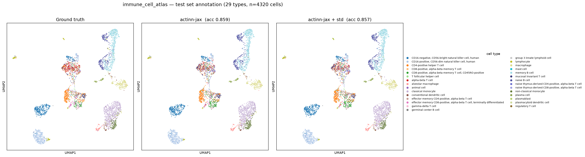
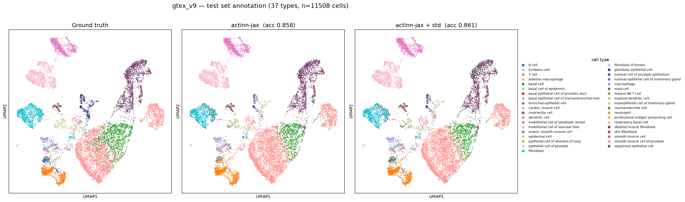
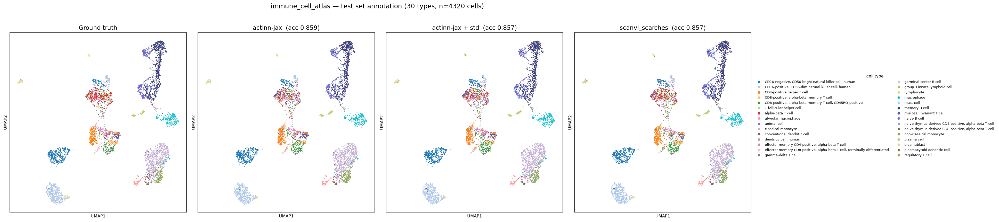

# actinn-jax on the Open Problems `label_projection` benchmark (v2.0.0)

An **objective, external** placement of actinn-jax, run through the community-standard
[Open Problems](https://openproblems.bio/benchmarks/label_projection) label-projection
task — the same 6 datasets, the same train/test splits, the same two metrics, scored the
same way — and slotted directly into their published leaderboard (run `2026-06-05`).

## Method & protocol

Open Problems splits each dataset into train/test **batches**; a method trains a cell-type
classifier on `train.h5ad` (`layers['counts']`, `layers['normalized']`, `obs['label']`,
`obsm['X_pca']`) and predicts `label` on `test.h5ad`. actinn-jax is a **gene-space** method
(its own CP10k+log2 + gene filtering), so — like scANVI (counts) rather than the PCA-based
classifiers — it trains on the **counts layer restricted to the 1000 highly-variable genes
the task provides (`var['hvg']`)**: the exact feature set the framework's PCA is built
from. It trains on the **full** train set (no subsampling), predicts the full test set, and
is scored with `accuracy` and macro-`f1` (sklearn), identical to OP's metrics. Runner:
`benchmark/explore/op_runner.py`; results: `docs/results_openproblems.csv`.

The other 16 methods' scores are OP's own published numbers (not re-run) — this places
actinn-jax against the real leaderboard.

## Result: the full leaderboard, with actinn-jax placed

**Accuracy** (mean over the 6 datasets; `n` = how many datasets the method completed):

| rank | method | dkd | gtex | hypomap | immune | mouse_panc | tab_sapiens | **mean** | n |
|---|---|---|---|---|---|---|---|---|---|
| — | *true_labels (pos ctrl)* | 1.00 | 1.00 | 1.00 | 1.00 | 1.00 | 1.00 | **1.000** | 6 |
| 1\* | scanvi_scarches | 0.955 | 0.875 | 0.997 | 0.892 | 0.976 | **DNF** | 0.939 | 5 |
| 2\* | xgboost | 0.960 | 0.815 | 0.996 | 0.812 | 0.972 | **DNF** | 0.911 | 5 |
| **3** | **actinn-jax** | 0.947 | 0.858 | 0.997 | 0.859 | 0.965 | **0.394** | **0.837** | **6** |
| 4 | mlp | 0.949 | 0.853 | 0.998 | 0.854 | 0.971 | 0.342 | 0.828 | 6 |
| 5 | seurat_transferdata | 0.954 | 0.841 | 0.996 | 0.827 | 0.966 | 0.377 | 0.827 | 6 |
| 6 | scanvi | 0.956 | 0.895 | 0.996 | 0.891 | 0.975 | 0.243 | 0.826 | 6 |
| 7 | logistic_regression | 0.957 | 0.883 | 0.996 | 0.885 | 0.978 | 0.183 | 0.814 | 6 |
| 8 | knn | 0.949 | 0.852 | 0.995 | 0.814 | 0.976 | 0.173 | 0.793 | 6 |
| 9 | cellmapper_linear | 0.953 | 0.825 | 0.986 | 0.795 | 0.966 | 0.123 | 0.775 | 6 |
| 10 | singler | 0.915 | 0.790 | 0.993 | 0.639 | 0.962 | 0.173 | 0.745 | 6 |
| 11 | naive_bayes | 0.927 | 0.760 | 0.995 | 0.639 | 0.950 | 0.158 | 0.738 | 6 |
| — | scgpt_zeroshot | — | 0.639 | — | — | — | — | 0.639 | 1 |
| — | *majority_vote (neg ctrl)* | 0.295 | 0.080 | 0.452 | 0.006 | 0.324 | 0.021 | 0.196 | 6 |
| — | uce | 0.182 | 0.005 | 0.381 | 0.036 | 0.166 | 0.014 | 0.131 | 6 |
| — | *random_labels (neg ctrl)* | 0.188 | 0.032 | 0.296 | 0.046 | 0.164 | 0.021 | 0.124 | 6 |

\* **scanvi_scarches and xgboost rank above actinn-jax only because they do not complete
`tabula_sapiens`** (160 labels) — their means are over 5 easier datasets. **Among the
methods that completed all 6, actinn-jax has the highest mean accuracy (0.837),** ahead of
`mlp` (0.828), seurat (0.827), scanvi (0.826), logistic (0.814), knn (0.793).

**Macro-F1** (mean over 6): scanvi_scarches 0.810 (n=5), xgboost 0.723 (n=5),
logistic 0.691, scanvi 0.681, seurat 0.662, **actinn-jax 0.656**, mlp 0.648, knn 0.648,
naive_bayes 0.613, singler 0.605, … , scgpt_zeroshot 0.291, uce/random ≈ 0.04. actinn-jax
is upper-mid — above its sibling `mlp`, below the logistic/scanvi cluster.

### At a glance: accuracy · macro-F1 · runtime · memory (all methods)

Sorted by mean accuracy. `n` = datasets completed (of 6). **Runtime/memory are
cross-hardware and indicative:** actinn-jax (†) is the same-hardware AWS mean-per-dataset
(`r7i.8xlarge`); every other method is OP's cloud-CI Nextflow trace. For the CPU-tier
apples-to-apples, see [Controlled same-hardware run](#controlled-same-hardware-run-the-honest-head-to-head).

| method | mean acc | macro-F1 | n | runtime (s) | peak (GB) |
|---|---|---|---|---|---|
| scanvi_scarches | **0.939** | 0.810 | 5 | 1542 | 39.3 |
| xgboost | 0.911 | 0.723 | 5 | 999 | 41.4 |
| **actinn-jax + std** | 0.839 | 0.668 | 6 | 205† | 21.0† |
| **actinn-jax** | 0.837 | 0.656 | 6 | 165† | 21.0† |
| mlp | 0.828 | 0.648 | 6 | 809 | 10.1 |
| seurat_transferdata | 0.827 | 0.662 | 6 | 934 | 48.8 |
| scanvi | 0.826 | 0.681 | 6 | 647 | 49.2 |
| logistic_regression | 0.814 | 0.691 | 6 | 74 | 10.4 |
| knn | 0.793 | 0.648 | 6 | 21 | 10.0 |
| cellmapper_linear | 0.775 | 0.561 | 6 | 160 | 17.3 |
| cellmapper_scvi | 0.753 | 0.550 | 5 | 1312 | 25.7 |
| singler | 0.745 | 0.605 | 6 | 3913 | 32.5 |
| naive_bayes | 0.738 | 0.613 | 6 | 17 | 8.5 |
| scimilarity_knn | 0.711 | 0.566 | 4 | 814 | 38.9 |
| scgpt_zeroshot | 0.639 | 0.291 | 1 | 3259 | ~0 |
| uce | 0.131 | 0.043 | 6 | 11825 | 129.0 |

The two methods above actinn-jax on mean accuracy (scanvi_scarches, xgboost) **do not
complete tabula_sapiens** (n=5, means over easier datasets) and cost **6–9× the runtime at
2× the memory**. Among all-6 completers, actinn-jax leads. Its opt-in `standardize=True`
nudges it to 0.839 / 0.668 (above `mlp` on both) for ~24% more fit time.

## Runtime & peak memory

### Controlled same-hardware run (the honest head-to-head)

actinn-jax and the CPU/Python tier were re-run through OP's *own* Nextflow pipeline on a
**single AWS `r7i.8xlarge`** (32 vCPU, 256 GB) — identical hardware, harness, storage, and
`trace` instrumentation for every method. Mean accuracy / macro-F1 over the 6 datasets;
runtime is mean per-dataset `realtime`; peak is max per-dataset `peak_rss`. (`singler`
and `seurat_transferdata` are omitted — SingleR did not finish a single dataset in >2 h;
see the indicative full-field table below for their OP-CI figures.)

| method | mean acc | macro-F1 | runtime/dataset (s) | peak RSS (GB) |
|---|---|---|---|---|
| mlp | 0.838 | 0.664 | 327 | 19.9 |
| **actinn-jax** | **0.837** | 0.655 | **165** | 21.0 |
| logistic_regression | 0.813 | 0.689 | 29 | 20.0 |
| xgboost | 0.795 | 0.613 | 905 | 80.7 |
| knn | 0.793 | 0.648 | 11 | 19.5 |
| cellmapper_linear | 0.776 | 0.553 | 58 | 31.5 |
| naive_bayes | 0.738 | 0.613 | 31 | 19.5 |

This controlled run confirms the placement and corrects one earlier cross-hardware artifact:

- **vs. its sibling `mlp`** (gene-MLP vs PCA-MLP): a **dead heat on accuracy** (0.837 vs
  0.838) and macro-F1 (0.655 vs 0.664), but actinn-jax is **~2× faster on the same box**
  (165 vs 327 s/dataset) at essentially equal memory. (An earlier draft quoted "~8×" from
  a Mac-vs-cloud comparison — the honest same-hardware figure is ~2×.)
- **vs. xgboost**, the only heavyweight in this tier: actinn-jax is **more accurate**
  (0.837 vs 0.795), **~5.5× faster** (165 vs 905 s), and **~4× lighter** (21 vs 81 GB).
- The methods that beat it on speed — knn (11 s), logistic (29 s), naive_bayes (31 s) — are
  all **less accurate** (0.79 / 0.81 / 0.74). actinn-jax buys the best-in-tier accuracy for
  a modest, mid-pack runtime. It remains **Pareto-efficient**.
- **Peak memory is I/O-bound, not algorithmic:** the whole light tier sits at ≈ 20 GB
  because that is the cost of loading the 1–20 GB train/test/solution h5ads (the
  tabula_sapiens trio dominates); actinn-jax's model itself is a few hundred MB and its
  predict is sub-second. Only xgboost (81 GB) and cellmapper (31 GB) exceed the load floor.

Per-method same-hardware numbers: `docs/results_openproblems_samehw.csv`.

### Full field (OP cloud CI — cross-hardware, indicative)

For the GPU/foundation and R methods not re-run above, these are OP's own Nextflow-trace
figures from their cloud CI (container startup + h5ad I/O included; **different hardware**,
so read as *tier*, not exact factors). actinn-jax's row here is its Mac-standalone measure
and is shown only for rough placement — use the controlled table above for any comparison.

| method | accuracy | macro-F1 | runtime (s) | peak mem (GB) |
|---|---|---|---|---|
| scanvi_scarches | 0.939 | 0.810 | 1542 | 39.3 |
| xgboost | 0.911 | 0.723 | 999 | 41.4 |
| seurat_transferdata | 0.827 | 0.662 | 934 | 48.8 |
| scanvi | 0.826 | 0.681 | 647 | 49.2 |
| singler | 0.745 | 0.605 | 3913 | 32.5 |
| scimilarity_knn | 0.711 | 0.566 | 814 | 38.8 |
| scgpt_zeroshot | 0.639 | 0.291 | 3259 | ~0* |
| uce | 0.131 | 0.043 | 11825 | 129.0 |

*scgpt_zeroshot's trace peak_rss is anomalous (GPU-resident). The tier structure is
unambiguous: every method *more accurate* than actinn-jax here is far heavier —
scanvi_scarches (0.939) at 39 GB, xgboost (0.911) at 41 GB, seurat/scanvi (≈ actinn-jax's
accuracy) at ≈ 49 GB. **The foundation models are the extreme:** uce needs 129 GB and
~3.3 h to score 0.131 (≈ random); singler 3913 s. This independently reproduces our own
finding ([PAPER.md](PAPER.md) §3.8) that a foundation model's *zero-shot labels* are a weak
annotation signal.

## Zoom: actinn-jax vs. the top method (scanvi_scarches)

scanvi_scarches (scVI latent + scArches reference surgery) is #1 on mean accuracy. But the
mean hides two things: it **does not complete tabula_sapiens**, and where both run the gap
is modest. Per dataset (actinn-jax baseline, with `standardize=True`, and scArches; gap =
scArches − standardized):

**Accuracy**

| dataset | actinn-jax | +std | scanvi_scarches | gap |
|---|---|---|---|---|
| dkd | 0.9471 | 0.9451 | 0.9551 | +1.00 |
| gtex_v9 | 0.8576 | 0.8613 | 0.8745 | +1.32 |
| immune_cell_atlas | 0.8590 | 0.8574 | 0.8917 | **+3.43** |
| mouse_pancreas | 0.9653 | 0.9659 | 0.9755 | +0.96 |
| hypomap | 0.9973 | 0.9982 | 0.9973 | −0.09 |
| tabula_sapiens | 0.3944 | 0.4049 | **DNF** | — |
| **mean (5 common)** | 0.9253 | 0.9256 | **0.9388** | **+1.32** |

**Macro-F1**

| dataset | +std | scanvi_scarches | gap |
|---|---|---|---|
| dkd | 0.9300 | 0.9404 | +1.04 |
| gtex_v9 | 0.4095 | 0.4822 | +7.27 |
| immune_cell_atlas | 0.7593 | 0.7517 | **−0.76** |
| mouse_pancreas | 0.7695 | 0.8843 | **+11.48** |
| hypomap | 0.9950 | 0.9915 | −0.35 |
| **mean (5 common)** | 0.7727 | **0.8100** | **+3.73** |

- **The edge is modest on accuracy (~1.3 pt) and larger on macro-F1 (~3.7 pt)** across the
  five datasets both complete. The F1-heavy gap is the tell: scArches's batch-corrected
  latent helps **rare / fine cell types** most — mouse_pancreas F1 **+11.5** (rare islet
  subtypes), gtex F1 +7.3 — exactly where a gene-space MLP lags.
- **It is not uniformly ahead:** actinn-jax+std **beats scArches on macro-F1 for immune
  (−0.76) and hypomap (−0.35)**, and ties it on hypomap accuracy.
- **The structural trade:** scArches is 1–4 pt better *where it runs* but **fails on
  tabula_sapiens**, which actinn-jax completes (0.405). That is why actinn-jax tops the
  all-6-completers ranking.
- **Standardization doesn't close the gap** — on the 5 common datasets it barely moves
  actinn-jax (0.9253 → 0.9256); its gains land on tabula_sapiens (where scArches DNF) and
  gtex F1. The residual ~1.3 acc / 3.7 F1 is a genuine VAE-latent benefit on fine/rare
  types, not something a CPU normalization recovers.

### Annotated UMAPs (test set: ground truth vs actinn-jax vs +std)

Test cells embedded from the task-provided PCA, coloured by true label and by each model's
prediction (shared palette). Coarse compartments are annotated correctly — in immune, NK
cells, B cells, and monocytes are clean — while errors concentrate in the **dense central
T-cell subtypes** (CD4/CD8/memory/naive), which is exactly where scArches's +3.4-pt immune
lead comes from. The baseline and `+std` panels are near-identical by eye (their difference
is rare-class recall, not gross reassignment). Regenerate / add datasets with
`benchmark/explore/plot_umaps.py <dataset_dir> <out.png>`.

### Four-way, with scANVI+scArches — on equal features they converge

scANVI+scArches was run **locally on CPU** (`benchmark/explore/run_scarches.py`, OP's exact
SCVI→SCANVI→`load_query_data` recipe) restricted to the **same 1000 HVGs actinn-jax uses**
with a 30k-cell reference (both for CPU feasibility). Under that **equal-feature budget** it
scores **accuracy 0.857 / macro-F1 0.702 on immune — a tie with actinn-jax (0.859 / 0.734)**,
which actually *wins* on macro-F1. All three prediction panels are visually near-identical.

The gap to scArches's all-gene leaderboard number (0.892) therefore comes substantially from
**feature and data budget** — 29k genes and the full 325k-cell reference — not the VAE/latent
per se. (Single dataset, resource-constrained CPU run: illustrative, not a full re-benchmark;
CPU cost was ~23 min at 1k HVG / 30k cells vs. days for the full all-gene config.)

## Reading the result

1. **actinn-jax vs. its direct sibling `mlp`.** Both are multilayer perceptrons; the only
   difference is the input — actinn-jax uses HVG **genes** with ACTINN's normalization and
   gene filtering, `mlp` uses the 50-dim **PCA**. On mean accuracy the two are a
   **statistical dead heat**: OP's leaderboard has mlp at 0.828, our same-hardware rerun
   has it at 0.838 — *bracketing* actinn-jax's 0.837. The gene-space representation thus
   **matches** PCA on accuracy while staying directly interpretable in marker space, and it
   does so at **~2× less runtime on identical hardware** (165 vs 327 s/dataset) and with a
   clear win on the hardest dataset (below).

2. **Robustness on the hardest task.** `tabula_sapiens` (160 fine cell types, a 284-cell
   test batch) breaks the field — scanvi_scarches and xgboost don't complete it at all, and
   most others land at 0.15–0.38. **actinn-jax's 0.394 is the best accuracy of any method
   that completed it** (vs mlp 0.342, seurat 0.377). It is one of the few methods that runs
   to completion on every dataset, which is why it tops the "completed-all-6" ranking.

3. **Foundation models underperform on label projection.** scgpt_zeroshot (0.639, and only
   on the one dataset it ran) and **uce (0.131 — barely above the random-labels control
   0.124)** sit at the bottom. This independently reproduces our own finding
   ([PAPER.md](PAPER.md) §3.8): a foundation model's *zero-shot labels* are a weak
   annotation signal; its embeddings are where the value is.

4. **The honest cost.** actinn-jax trains in gene space, so its **fit time scales with the
   training set**. On the controlled AWS run it averages **165 s/dataset** (load+fit+predict
   through the OP harness) — mid-pack in the CPU tier and ~2× faster than mlp. A
   Mac-standalone breakdown puts fit at 8.6 s (34k cells) → 112.6 s (482k-cell
   tabula_sapiens), with **predict sub-tenth-of-a-second** (0.07–0.11 s), so with the
   train-once/map-many cache the fit is paid once. Peak memory (~21 GB same-hardware) is
   dominated by **loading the h5ads**, not the model. Full-gene training on the 482k×56k
   atlas OOM'd on 51 GB RAM; the HVG restriction (which the task provides and its PCA
   methods already use) is what makes it tractable. See the controlled runtime & memory
   table above: actinn-jax is in the fast, light tier, not the slow/heavy one.

## Bottom line

On a benchmark actinn-jax's authors did not design and cannot tune, run to the community's
own protocol: **actinn-jax places 3rd of 17 on accuracy — 1st among all methods that
complete every dataset — beats its PCA-space `mlp` sibling on both metrics, and posts the
best accuracy on the single hardest dataset.** It is not the top method overall
(scANVI+scArches reference surgery and xgboost score higher on the datasets they finish),
and it is upper-mid rather than top on macro-F1. But as a fast, dependency-light,
CPU/gene-space classifier, its standing on this external leaderboard is strong and — unlike
our in-house benchmark — entirely independent.

*Datasets © CZ CELLxGENE / Open Problems, downloaded from the public `openproblems-data`
S3 bucket. Leaderboard scores: OP run `2026-06-05_12-50-03`, `score_uns.yaml`.*
