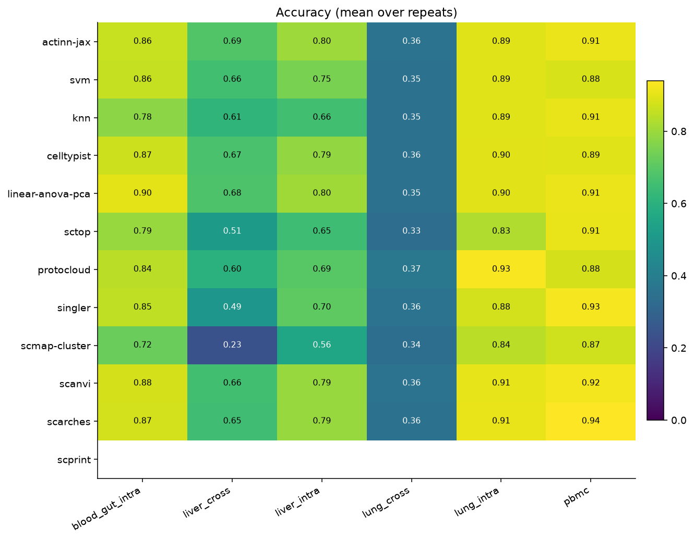
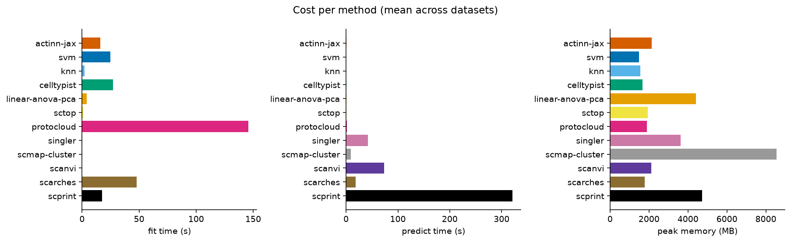
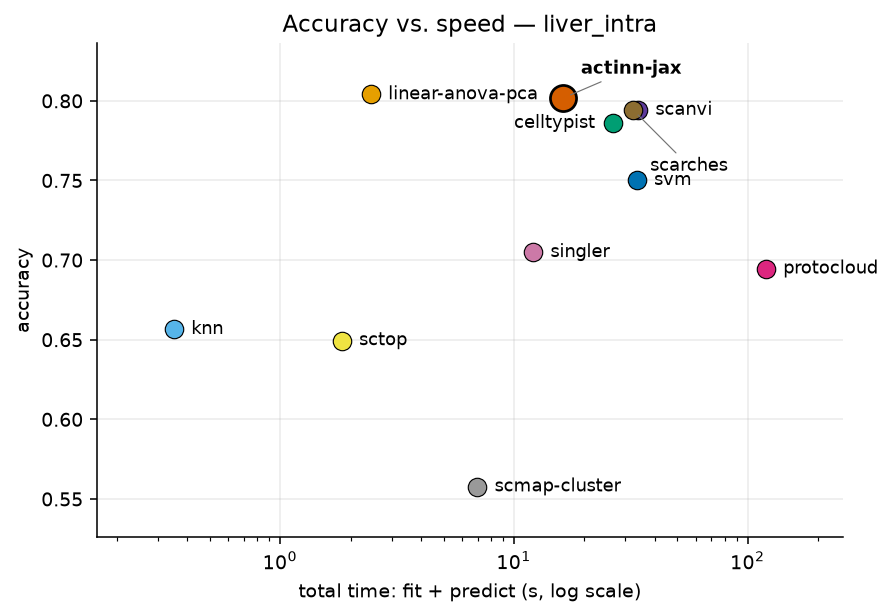
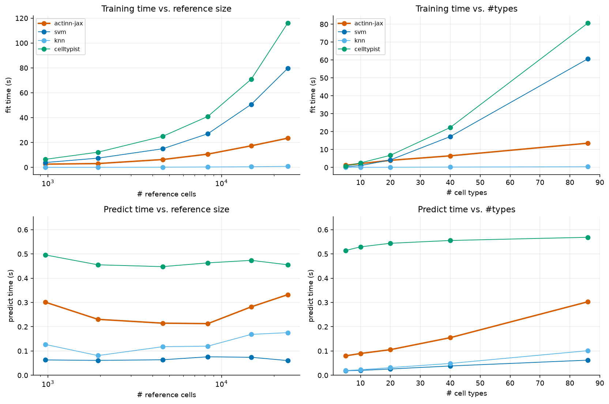
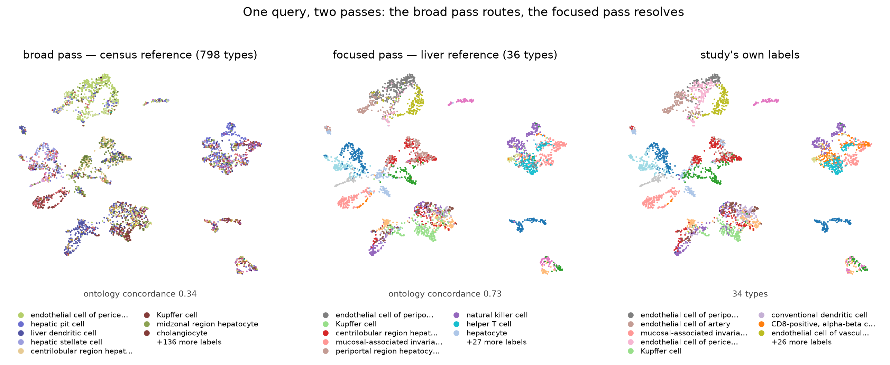
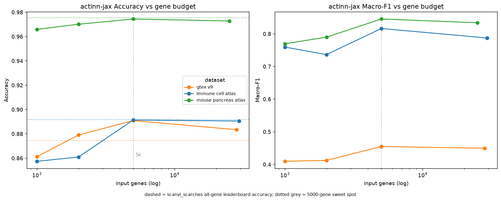
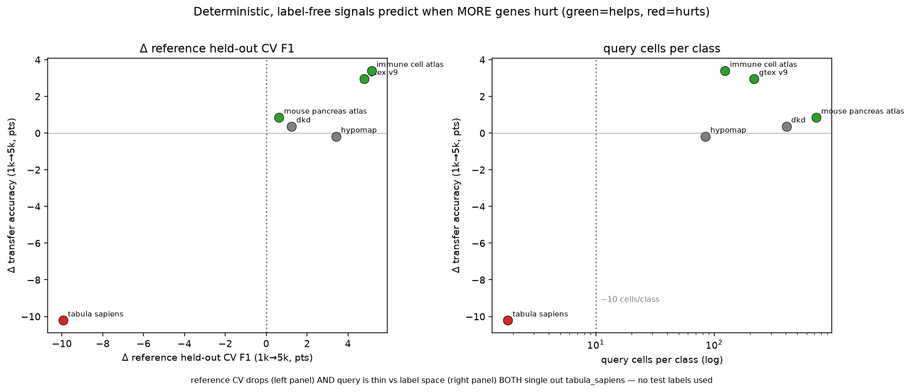

# Annotating single-cell data on a laptop: a 13-method benchmark and practical low-memory workflows, with actinn-jax

*In-repo benchmark report. Numbers are generated by `configs/paper.yaml` +
`configs/paper_scprint.yaml` (results in `results/paper/`), the scaling experiment
(`benchmark/explore/scaling_experiment.py`), and the rejection experiment; figures by
`benchmark/explore/make_figures.py`. This report is regenerated from those artifacts, not
hand-entered.*

> **Status:** all results are final. Every method in §3.1 runs the same six datasets on
> the same splits. §3.7 adds an independent external validation on the community **Open
> Problems** `label_projection` benchmark, including a **controlled same-hardware** run
> (every method on one AWS instance). Supporting detail lives in
> [`SIMPLE_BASELINES.md`](SIMPLE_BASELINES.md), [`PROTOCLOUD.md`](PROTOCLOUD.md) and
> [`SCALING_MEMORY.md`](SCALING_MEMORY.md).

## Abstract

Reference-based cell-type annotation is a routine, high-volume step in single-cell
analysis, and most labs run it on a laptop, not a GPU cluster. We present **actinn-jax**, a
from-scratch JAX reimplementation of ACTINN (a 4-layer MLP classifier) with a sparse-aware
pipeline and a train-once/map-many cached reference model, and use it as the occasion for a
neutral benchmark of **thirteen** methods spanning every major class — classical (SVM, kNN),
regularized-linear (CellTypist), a carefully-tuned linear pipeline, parameter-free
projection (scTOP), marker/correlation (SingleR, scmap),
deep probabilistic (scANVI, scArches), an interpretable prototype VAE (ProtoCloud), and a
foundation model (scPRINT) — across **six** datasets (within-dataset, cross-dataset and
cross-study; 8 to 86 cell types) plus a five-point **scaling sweep to 49k reference cells**,
measuring accuracy, macro-F1, ontology-aware concordance, training and inference time, and
peak memory on commodity Apple-Silicon hardware.

**Accuracy differences among the leading methods are small; their cost differences are not.**
The top of the accuracy table is a four-way cluster spanning 0.008 (0.831–0.839), led by a
carefully preprocessed **linear pipeline** (normalize → ANOVA → PCA → logistic regression,
0.839) rather than by a deep model, with scANVI, scArches and actinn-jax (0.831) alongside it.
**Those same four methods differ by ~130× in inference time** (0.34 s to 89 s) **and 2.4× in
peak memory** (1.8 to 4.3 GB). The linear pipeline is the most accurate-per-second option on
laptop-sized data, fitting 7× faster than actinn-jax (3.0 vs. 21.9 s). At atlas scale the ordering changes: **ProtoCloud** rises from worst at 3k reference
cells (0.722) to best at 49k (**0.976**, vs. 0.936 for actinn-jax and 0.939 for the linear
pipeline). No method leads everywhere, and methods separated by less than a percentage point
of accuracy are separated by two orders of magnitude in cost.

Because several methods now annotate quickly, accurately, and with a usable handle on unknown
cells, the useful contribution is not another ranking but an account of **which tool fits
which job, and what the surrounding workflow looks like**. Every method is run on every
dataset through one harness on identical splits, the panel deliberately includes the
baselines most likely to beat a small MLP, and the external validation is somebody else's
benchmark — **Open Problems (OP)** `label_projection`, whose datasets, metrics and ranking we
did not choose. We report the results as a decision aid (accuracy-per-second, accuracy-per-byte, and
behaviour from 3k to 49k reference cells), then use actinn-jax to demonstrate **end-to-end
workflows that a low, flat cost profile makes practical**, on human data and — via a
hierarchy derived from the Cell Ontology, which removes the GPU step from building a
reference — on mouse:
annotating an unknown human dataset from a **shipped census-scale
reference** (~800 cell types, calibrated abstain) with no training; **tissue-aware
refinement** that halves spurious cross-tissue labels on a liver query; a **broad→refined
hand-off** to a small focused reference (held-out cross-study liver 0.23/0.58 → 0.72/0.86,
exact-match / Cell-Ontology-aware); within-cell-type resolution (hepatocyte zonation); and a **cluster-level
novel-cell-type screen** that recovers a withheld pulmonary ionocyte population and its marker
ASCL3. What enables this is inference that is **sub-second and flat** — independent of
reference size and cardinality — over a cached reference that is trained once and reused,
at the lowest peak memory of the methods we carried to atlas scale (6.1 vs. 13.2 GB for the
linear pipeline at 49k cells). The components are not unique: ProtoCloud provides
uncertainty, gene attribution and a retraining-based refinement path, and **Pan-human
Azimuth** ships a pretrained, calibrated, hierarchical pan-human annotator that runs on a
laptop — a better-resourced broad tier than ours, and one we can **distill into a broad-pass
model of comparable accuracy at ~9× its throughput, built with no GPU and no labeled data**.
What the workflow adds is the **hand-off into a label set the broad model was never trained
on**: refinement against a user's own focused reference, and resolution below any fixed
typology's leaves.

## 1. Introduction

Annotating cell types by mapping to a labeled reference is one of the most frequently run
operations in single-cell RNA-seq. The method landscape is large ([survey](METHODS_SURVEY.md)),
but published comparisons ([Abdelaal 2019], [Fu 2024]) emphasize accuracy and rarely
report the axis that decides what a working scientist actually runs on their own machine:
**wall-clock time and memory on commodity hardware**, without a GPU. Foundation models
(scGPT, Geneformer, scPRINT) push accuracy in some settings but need GPUs and minutes-to-
hours, and — as we and others find — their *zero-shot* label predictions underperform a
small model trained on curated reference labels.

We ask a practical question: **for a given annotation job on commodity hardware, which
method should you actually run, and what does the surrounding workflow look like?** Several
methods now annotate quickly and accurately and give a usable signal on unknown cells, so
the shortage is not another leaderboard but guidance on fit-for-purpose — accuracy per
second, accuracy per byte, and how each behaves as the reference grows. We answer with a
neutral 13-method benchmark plus a set of demonstrated workflows, held to a single standard:
every method runs in its own environment through the same harness, on the same splits, scored
by the same metrics, and reported as measured — including where actinn-jax is not the leader.

**How the comparison was constrained.** A benchmark written by a method's own author has a
well-known failure mode: the datasets, baselines and metrics that flatter the method are the
ones that get reported. We tried to design that freedom out rather than promise restraint.
Every method runs on **every** dataset, so none appears on a favourable subset, and the two
methods outside that matrix are named with reasons (§2.2). The panel was chosen to include
the baselines most likely to beat a small MLP — a carefully tuned linear pipeline, scTOP,
ProtoCloud — and each of them does beat it somewhere; our own classical tier is left untuned
while the linear baseline is tuned, which is the unfavourable direction (§5). Metrics are
fixed across all methods and reported in full. Most importantly, the **external validation is
somebody else's**: Open Problems `label_projection` (§3.7) sets the datasets, the metrics and
the ranking, and we did not choose any of them. Where results contradict our own earlier
claims or our method's interests — ProtoCloud overtaking actinn-jax at atlas scale, a bounded
rather than widening memory advantage, a better-resourced broad annotator than our own — they
are reported in those terms.

**On adding another method to a crowded field.** We are adding one, and we think it earns
its place: the original ACTINN no longer installs or runs on current toolchains, and the
reimplementation's flat, sub-second, memory-bounded inference over a cached reference is what
makes the multi-stage workflow of §3.4 practical on a laptop. What we are *not* doing is the
move that makes method papers hard to trust — concluding that the new method wins. It does
not: on accuracy it sits inside a four-way cluster it does not lead, the panel was assembled
to include the baselines most likely to beat it, and they do. A field already full of working
methods ([xkcd 927]) is a good reason to be specific about what a new entry is *for* — here,
a cost profile that lets several models be chained — rather than to claim it supersedes what
exists. Where a better-resourced model already exists, the productive move is to build on it
(§3.4).

**Contributions.**

1. A modern, dependency-light (no TensorFlow) JAX reimplementation of ACTINN with sparse
   preprocessing, chunked atlas-scale prediction, and a cached reference model.
2. A neutral **13-method × 6-dataset** benchmark of accuracy, speed, and memory on Apple
   Silicon, with a rejection/abstain analysis and a **five-point scaling sweep to 49k
   reference cells**. The panel deliberately includes the baselines most likely to beat a
   small MLP — a tuned linear pipeline, scTOP, and ProtoCloud — and the results are reported
   as measured (§3.1, §5). The sweep is also what sets actinn-jax's minibatch policy: at
   ACTINN's fixed batch of 128, a 47k-cell reference costs ~24k tiny update steps, so
   actinn-jax scales the batch with the reference above ~12.8k cells and keeps 128 below it.
   Measured fit and predict curves are in §3.3.
3. **Demonstrated end-to-end workflows** for jobs where cost is the binding constraint,
   all CPU: annotate an unknown human dataset from a **shipped census-wide ~800-type
   reference** with a calibrated abstain and no training; **tissue-aware refinement** (halves
   spurious cross-tissue labels on a liver query); a **broad→refined hand-off** to a small
   focused reference (cross-study liver 0.23/0.58 → 0.72/0.86); within-cell-type resolution
   (hepatocyte zonation); and a **one-call novel-cell-type screen** (recovers a withheld
   pulmonary ionocyte population and its marker ASCL3). We are precise about what is not
   ours: ProtoCloud offers uncertainty, attribution and a retraining-based refine, and
   Pan-human Azimuth ships a pretrained hierarchical pan-human annotator with trained
   abstention, so the broad tier itself is not a distinguishing feature — we distill that
   model into a broad-pass reference rather than compete with it. What is distinct is
   **refinement into a label set no pretrained model carries** — the user's own focused
   reference, and states below a fixed typology's leaves. The same route builds a
   **pan-mouse reference** (453 types / 85 tissues; 0.638 ontology concordance on two
   withheld datasets) in 17 s of CPU, using Cell Ontology lineage in place of a
   foundation-model embedding — which beats the embedding-derived hierarchy on the human
   corpus it was validated against, and needs no GPU at any stage.
4. An **independent external validation** on Open Problems `label_projection`, with a
   controlled same-hardware speed/memory comparison, and a set of cheap ablations that
   characterize *when* the gene-space model gains or loses to heavier methods (input
   standardization; a reference-guided gene budget; a foundation-model negative control).

## 2. Methods

### 2.1 actinn-jax

actinn-jax reimplements ACTINN ([Ma & Pellegrini 2020]) — a 4-layer fully-connected
network (100/50/25 hidden units, ReLU, softmax) trained with Adam — in JAX/optax
([Bradbury 2018]), replacing
the original's TensorFlow-1.x graph/session code. Key engineering:

- **Sparse-aware preprocessing**: no `adata.to_df()` densification; CP10k+log2
  normalization and the expression / coefficient-of-variation gene filter run on sparse
  matrices; only the selected-gene
  columns of each minibatch are densified.
- **Cached reference model** (`ReferenceModel`): train once, `save()`/`load()`, map many
  queries — the amortized cost of repeated annotation against a fixed reference drops to
  the inference cost alone.
- **Chunked prediction** for atlas-scale queries; **`use_raw='auto'`** to pick raw counts
  from `.raw` (CELLxGENE convention).
- **Optional reference-fit standardization** (`standardize=True`): z-score each selected
  gene by the reference's frozen mean/std and apply it to the query — a cheap domain
  alignment (§3.7). Opt-in, with a saved scaler that projects with the model; μ/σ persist in
  the `.npz` (old models load standardization-off, backward-compatible).
The reimplementation reproduces the original's accuracy to within repeat noise while being
**substantially faster and lighter and, unlike the TensorFlow-1.x original, installable on
current Python/ML environments** — the original's `tf.compat.v1` graph/session code no longer
runs on a modern stack without pinning a years-old TensorFlow. Because the two are the same
model at equal accuracy, we do not carry the original as a separate benchmark row; the
engineering win is the point, not an accuracy comparison.

### 2.2 Benchmarked methods

| method | source | tier | engine | rejection | env |
|-----------|------------|-----------|----------------------|----------|----------|
| **actinn-jax** | [Ma & Pellegrini 2020] | classical | JAX MLP | abstain (`min_prob`) | core |
| SVM | [Pedregosa 2011] | classical | linear SVM (SGD) | — | core |
| kNN | [Pedregosa 2011] | classical | k-nearest neighbors | — | core |
| CellTypist | [Domínguez Conde 2022] | linear | L2 logistic regression | prob threshold | core |
| **linear-anova-pca** | [Pedregosa 2011] † | linear | normalize → ANOVA → PCA(220) → logreg | prob | core |
| **scTOP** | [Yampolskaya 2023] | parameter-free | rank z-score class-average projection | — | protocloud |
| SingleR | [Aran 2019] | correlation | Spearman + fine-tuning | — | R/.Rlib |
| scmap-cluster | [Kiselev 2018] | correlation | centroid cosine | yes (unassigned) | R/.Rlib |
| scANVI | [Xu 2021] | deep | scVI semi-supervised VAE | prob | scvi (MPS) |
| scArches | [Lotfollahi 2022] | deep | scANVI reference surgery | prob | scvi (MPS) |
| **ProtoCloud** | [Guo & Ding 2026] | deep | prototype VAE + LRP attribution | ambiguity flag | protocloud |
| scPRINT | [Kalfon 2025] | foundation | pretrained transformer, zero-shot | — | scprint (MPS) |
| **Pan-human Azimuth** | [Sarkar et al. 2026] | pretrained | 8-level hierarchical NN, fixed 382-leaf typology | trained `Unassigned` | panhuman |

**Table 1.** The benchmarked methods: model family (*tier*), the engine each one actually runs,
whether it can decline to call a cell (*rejection*), and the pinned environment it was run in
(§2.7). Bold marks the methods added to this panel here.

† `linear-anova-pca` has no method paper: it is a baseline assembled here from scikit-learn
components, tuned deliberately to be the strongest simple competitor we could build (§1).

**Eleven of the thirteen are trained on each dataset's own reference** and run the full
accuracy/cost matrix of §3.1 on all six datasets, so none is compared on a favourable subset.
The remaining two are **pretrained annotators with fixed label vocabularies**, which changes
what can be measured rather than excusing them from measurement:

- **scPRINT** is a zero-shot foundation model over a fixed **Cell Ontology (CL)** vocabulary —
  CL being the standard controlled vocabulary of cell types, used throughout as the common
  ground between datasets that name the same cell differently; it cannot
  emit labels outside that set and skips symbol-keyed datasets.
- **Pan-human Azimuth** ([Sarkar et al. 2026]) is a supervised hierarchical classifier over a
  single organism-wide typology — 8 levels, 382 leaves, ~7M parameters, a fixed 5,055-gene
  panel, trained on 9.7M curated cells, with abstention *learned rather than thresholded* —
  the model is trained to answer `Unassigned`, instead of having a probability cutoff applied
  to its output afterwards. It is the closest published counterpart to this paper's broad
  pass, and the teacher we distill in §3.4. Adapter:
  [`panhuman_adapter.py`](../benchmark/adapters/panhuman_adapter.py).

Neither predicts into the dataset's label strings, so **exact-match accuracy against those
strings is a vocabulary artifact, not an accuracy signal** — `regulatory T cell` → `Treg cell`
and `non-classical monocyte` → `CD16 monocyte` are correct answers that score zero. Both are
therefore scored **ontology-only** (§2.4) and reported in their own block in §3.1, on the
three datasets where reference and query both carry Cell Ontology ids. They appear again in
§3.6 (foundation-model zero-shot) and §3.4 (Azimuth as broad pass, and as distillation
teacher).

**scPred** is excluded outright: unmaintained; it requires harmony's removed `HarmonyMatrix`
API and older harmony versions do not compile on the current toolchain.

### 2.3 Datasets

| dataset | source | split | tissue | #types | genes | notes |
|-------------|----------|-------|-----------|------|-------|-----------|
| lung_intra | [Travaglini 2020] | within-dataset | lung (Krasnow) | 46 | Ensembl | 300 cells/type ref |
| lung_cross | [Sikkema 2023] → [Travaglini 2020] | cross-dataset | lung (HLCA → Krasnow) | 46 | Ensembl | different lab/protocol |
| liver_intra | [Edgar 2026] | within-dataset | liver (HLiCA) | 36 | Ensembl | 150 cells/type |
| liver_cross | [Edgar 2026] | cross-**study** | liver (HLiCA) | 34 | Ensembl | train 6 studies → test withheld study |
| blood_gut_intra | [Alegbe 2026] | within-dataset | blood + gut (IBDverse) | 86 | Ensembl | high cardinality; no CL ids |
| pbmc | [10x Genomics 2016] | within-dataset | PBMC (pbmc3k) | 8 | symbols | small-n; scPRINT skips (symbols) |

**Table 2.** The six benchmark datasets. *split* separates within-dataset holdouts from
cross-dataset and cross-study transfer; *genes* records whether the matrix is keyed by Ensembl
ids or by gene symbols, which decides who can read it.

The blood+gut set is a subsample of **IBDverse** (Wellcome Sanger Institute; blood, terminal
ileum and rectum from 421 individuals), included here because 86 fine-grained labels make it
the high-cardinality stress case for the panel. It carries no Cell Ontology ids, so it
contributes to accuracy and macro-F1 but to no ontology-scored result.

The set spans the three generalization regimes (within-dataset, across datasets, across
studies), an order of magnitude in cell-type count (8→86), and both gene-ID conventions.

### 2.4 Metrics

Per (dataset, method, repeat): **accuracy**; **macro-F1**, unweighted over classes so rare
types count as much as common ones; **ontology-aware concordance**; **fit time**, **predict
time**, and **peak RSS** (resident set size — the maximum physical memory the process held).

**Ontology-aware concordance** credits a call that is the same node, an ancestor, or a
descendant of the truth in the Cell Ontology. It exists because cell-type vocabularies
disagree about granularity more than about biology: `periportal region hepatocyte` against
`Hepatocyte` is a right-lineage-wrong-depth call, which exact match scores as a total failure
and a working scientist would accept. It is the **only** metric that compares methods with
different label vocabularies (§2.2), and it is reported only where both reference and query
carry CL ids — so not on `blood_gut_intra`, and not on the symbol-keyed `pbmc`.

Concordance depends on the ontology release, since ancestor sets change between them. All
numbers here use **`cl-basic.obo`, CL release 2026-06-08**
(sha256 `73996c63…`), resolved once and reused by every scoring pass (`benchmark/metrics.py`,
via `pronto`). This is not a hypothetical concern: re-running `lung_cross` against a
later-fetched release reproduced the splits exactly (14,390 reference / 13,550 query cells)
and still moved concordance by 0.003, with no model changing. The release, its checksum, and
exact versions for all six benchmark environments are recorded in `envs/locks/`
(`tools/freeze_envs.py --check` reports drift).

Exact-match accuracy is reported for the ten reference-trained methods and, on `lung_cross`,
flagged: reference and query use different label vocabularies there, so its exact accuracy is
a vocabulary artifact and the ranking, not the level, is what transfers.

### 2.5 Harness, isolation, and hardware

The runner, `benchmark/runner.py`, executes each method in **its own virtual environment
under subprocess isolation**, because the dependency sets are mutually unsatisfiable — scVI-based
methods, TensorFlow/Keras (Pan-human Azimuth), R (SingleR, scmap) and the JAX core cannot
coexist in one interpreter. The driver, `benchmark/driver.py`, builds the reference/query
split **once per dataset** from a fixed seed and hands the identical pair to every method, so
no method sees a different split. **repeats = 3**; scPRINT and Pan-human Azimuth run once
each, being deterministic given a fixed query and dominated by a single forward pass.

Resource accounting is per subprocess: fit and predict are timed separately and peak RSS is
sampled by a monitor thread in the child, so one method's footprint cannot be attributed to
another.

**Hardware**: Apple Silicon (M-series), CPU for the classical, linear, correlation and
pretrained tiers and for actinn-jax; Apple MPS for the deep and foundation tiers. No discrete
GPU, no cloud — the regime the benchmark is about. Math-library threads are left uncapped, so
wall-clock is what a practitioner sees; an optional thread cap exists for stricter
reproducibility. §3.7 repeats the comparison on one cloud CPU instance, where matched
concurrency matters and is discussed (§2.10).

### 2.6 Building a broad reference

The shipped broad-pass references (§3.4) are built once, offline, by a three-stage pipeline
driven by one command (`update_broad_reference.sh`;
[UPDATE_BROAD_REFERENCE.md](UPDATE_BROAD_REFERENCE.md)).

**Sampling.** All primary cells for one organism in the CELLxGENE Census [CZI Census 2025]
(`is_primary_data == True`), stratified by `cell_type` at a fixed cap per type — 40 for
`broad_human_v1`, 60 for the later human and mouse pulls — dropping types with fewer than 12
cells and the uninformative labels (`unknown`, `native cell`, `eukaryotic cell`, `animal
cell`). The pull is checkpointed per batch of ten datasets and retried, since transient
TileDB/S3 read errors are routine at this scale. Both `feature_id` (Ensembl) and
`feature_name` (symbol) are carried, because symbol-keyed consumers cannot use an
Ensembl-only pull. `stable` is a moving pointer, so the resolved release is recorded; every
reference here comes from **census 2025-11-08**.

**Coarse hierarchy — two interchangeable routes.** The model is a coarse classifier over
groups plus one fine classifier per group, and the grouping comes from either:

1. **Foundation-model embeddings.** scPRINT (`medium-v1.5`) embeds the reference once in
   4,000-cell chunks; per-cell-type centroids are Ward-clustered into
   `max(8, round(√n_types))` groups. scPRINT's QC drops cells, so the embedding is not
   positionally aligned to the input and the label is carried through the model with the
   vectors. This is the only step that wants a GPU/MPS.
2. **Cell Ontology lineage.** Each cell type is described by a binary indicator over the CL
   terms it descends from; terms appearing in fewer than two types, or in all of them, are
   dropped as uninformative; the same Ward clustering is applied to those vectors
   (`ontology_hierarchy.py`). Free, deterministic, and species-independent — which is what
   makes the pan-mouse reference possible, since the distillation teacher is human-only and
   scPRINT's mouse support is untested here. §3.4 compares the two routes against a
   random-grouping control.

**Training and calibration.** A 4,000-gene panel of **highly variable genes (HVGs)** — the
genes that differ most across cells, and so carry most of the signal for telling types apart —
is selected on the reference; the coarse
and per-group fine models are trained on it. Abstain calibration holds out **10% of cell types
entirely** as out-of-distribution (OOD — types the model was never trained on, standing in for
the novel populations a real query contains), plus a 20% within-type test split, and sweeps `min_prob` to
trade coverage against accuracy on kept cells — the table each shipped reference reports.

**Shipping and verification.** Each reference is written with a `build_info.json` recording
census release, corpus sizes, hierarchy route, organism and calibration table. Because a
rebuild can train cleanly and annotate *worse*, the previous reference is backed up and the
new one is scored on a held-out atlas before it is kept (`verify_reference.py`). For
`broad_mouse_v1` the test set is carved from the census itself: two datasets are excluded from
the reference sample and re-pulled as the query, so "held out" means held-out *datasets* and
not merely held-out cells (`EXCLUDE_DATASETS` / `ONLY_DATASETS`).

### 2.7 Distilling a pretrained annotator

A broad reference can also be built without labels and without a GPU, by taking both the label
vocabulary and the hierarchy from an existing pretrained annotator
([PANHUMAN_DISTILL.md](PANHUMAN_DISTILL.md)). Keras/TensorFlow and JAX cannot share a process,
so this runs in two stages.

**Teacher pass** (`distill_dump.py`, `.venv-panhuman`). Pan-human Azimuth labels a corpus of
raw counts through its low-level API (`AzimuthNN_base`, batch 8,192), which loads weights once
rather than per call. All eight levels are retained. Where the package cannot reconcile a
refined level with its coarser ones it blanks that column to boolean `False`; those cells still
carry a deepest-level call, so we fall back to it rather than discard them — dropping them
would distill only the cells the teacher found easy. Predictions are mapped to CL ids through
the package's own crosswalk.

**Student pass** (`distill_train.py`, core venv). The student is a
`HierarchicalReferenceModel` whose **classes** are the teacher's refined fine labels
(including its trained `Unassigned` quality-control class) and whose **hierarchy** is the
teacher's own broad level — so the coarse→fine structure is inherited rather than rediscovered.
4,000-gene HVG panel; classes with fewer than 8 cells dropped, since a class that cannot be
split into train and test makes fidelity depend on which side its cells landed.

**Corpus.** Three local atlases (lung, liver, blood+gut) capped at 600 cells per label, plus a
census-wide pull (≤60 per type). The atlases' own labels are used **only for scoring**, never
for training.

**Evaluation.** Two arms answer different questions. *In-corpus* holds out a stratified 25% of
cells and measures **fidelity** — how often the student reproduces the teacher, exactly and
ontology-equivalently. *Held-out atlas* withholds an entire atlas and measures whether the
student generalizes to data the corpus never covered. Both arms also score student and teacher
against the atlases' own labels, which separates distillation loss from teacher error. Note
that once the census pull is in the corpus, a withheld *atlas* is no longer a withheld
*tissue*.

### 2.8 Refinement, abstention, and novelty

Four mechanisms operate on a trained reference at inference time, all label-free.

- **`min_prob` abstention.** Cells whose final probability is below the threshold are relabeled
  `unknown` rather than forced to the nearest class. Calibrated per reference (§2.6).
- **`refine_to_query`.** The reference's class set is masked to those classes the query's own
  predictions actually support, and the softmax renormalized — no ground truth, no retraining.
- **`refine_to_tissue`.** Classes are masked to those the census records in the given tissue,
  while **pan-tissue** types (immune, endothelial, stromal) stay available everywhere, so
  liver-resident T cells are unaffected. The per-class `tissue_general` map is baked into the
  shipped reference; tissue is passed explicitly or read from `adata.obs`, with common synonyms
  (`PBMC`→blood, `hepatic`→liver) recognized. A tissue outside the reference's vocabulary
  imposes no filter rather than an empty one.
- **Cluster-level novelty screen.** A cell type absent from the reference appears not as
  scattered uncertain cells but as a *coherent group the reference cannot confidently explain*.
  `detect_novel_celltypes` flags clusters that are both large enough to be a real population
  (`min_cells`) and predominantly low-confidence, and reports marker genes for each. This is
  distinct from per-cell abstention.

**Within-type state.** The same machinery resolves structure below a cell-type label: a
hepatocyte zonation model trained on portal→central zone labels, scored by within-one-zone
agreement across donors and datasets ([ZONATION.md](ZONATION.md)).

### 2.9 Scaling protocol

The reference is subsampled to five sizes up to **49k cells** with the query held fixed, so
that accuracy, fit time, predict time and peak memory are functions of reference size alone.
Reported per method; the point of interest is which curves cross
([SCALING_MEMORY.md](SCALING_MEMORY.md)).

### 2.10 External validation protocol

**Open Problems `label_projection`** [Open Problems 2024]
([OPENPROBLEMS.md](OPENPROBLEMS.md)) supplies the
datasets, metrics and ranking — none chosen by us. actinn-jax is packaged as a viash 0.9.7
component (`config.vsh.yaml` + `script.py`) declaring its `preferred_normalization`, and run
through the project's own Nextflow workflow. We additionally built components for four
baselines (linear-anova-pca, scTOP, SVM, CellTypist) so the same-hardware comparison covers
more than the leaderboard's own set.

Two caveats govern how those numbers may be read. The leaderboard aggregates runs from
**heterogeneous cloud hardware**, so its timings are not a controlled cost comparison — hence
the same-hardware run: every method on one AWS CPU instance. And in that run, **wall-clock is
only meaningful at matched concurrency**: with several tasks per box, `%cpu` spanned 49% to
2338% across methods, so cross-method runtime ratios measured at high concurrency rank
threading and scheduler contention as much as algorithm. Cost is therefore reported only
from the matched-concurrency run (Table 10); the four components we added to the harness are
compared on accuracy alone (Table 11), which does not depend on the machine.

### 2.11 Ablations

Three cheap interventions characterize *when* a gene-space MLP gains or loses against heavier
methods, all selectable without test labels:

- **Input standardization** — z-score each selected gene by the reference's frozen mean/std
  and apply to the query (a scArches-style domain alignment). Opt-in, because it shifts the
  probability calibration the abstain thresholds are tuned against.
- **Gene budget** — Open Problems feeds every method 1,000 HVGs; we sweep wider panels and
  select per dataset by **held-out reference cross-validation**, which is label-free with
  respect to the test set.
- **Protein-embedding featurization** (negative control) — a CPU-only featurization in the style of **Universal Cell Embeddings (UCE)** [Rosen 2026] — an
  expression-weighted mean of ESM2 [Lin 2023] protein-language-model gene embeddings — to test whether a foundation model's value
  survives a cheap pooling shortcut.

## 3. Results

### 3.1 Accuracy and cost

**Figure 1.** Accuracy by method (rows) and dataset (columns) across the in-house panel.

**Figure 2.** Fit time, per-query predict time, and peak memory by method, averaged across the
in-house panel. The methods sit within a few points of each other on accuracy (Table 3) and
orders of magnitude apart on cost.

Accuracy and cost belong in one table: the finding is not where either lands, but how little
they relate. Accuracy is the mean over the **five shared-vocabulary datasets** (lung_cross
excluded — its exact accuracy is a vocabulary artifact, see the † note below; means over all
six are ~0.08 lower for every method, with the identical ranking); macro-F1 and ontology are
means over all six; cost is the mean per query (Table 3):

| method | acc (5) | macro-F1 (6) | ontology (6) | fit (s) | **predict (s)** | peak MB |
|----------|----:|----:|----:|----:|----:|----:|
| **linear-anova-pca** | **0.839** | 0.699 | 0.808 | **3.0** | **0.34** | 4294 |
| scANVI | 0.833 | 0.697 | 0.809 | 0.0* | 89.2 | 2099 |
| scArches | 0.832 | **0.699** | 0.805 | 54.7 | 21.4 | 1819 |
| **actinn-jax** | 0.831 | 0.683 | **0.811** | 21.9 | **0.67** | 2399 |
| CellTypist | 0.823 | 0.691 | 0.805 | 60.7 | **0.66** | 1569 |
| SVM | 0.810 | 0.680 | 0.797 | 66.5 | **0.07** | 1415 |
| ProtoCloud | 0.790 | 0.649 | 0.778 | 176.3 | 2.14 | 1893 |
| SingleR | 0.770 | 0.652 | 0.750 | 0.3 | 62.1 | 3541 |
| kNN | 0.770 | 0.622 | 0.769 | 0.4 | **0.15** | 1483 |
| scTOP | 0.739 | 0.619 | 0.703 | 1.1 | 1.07 | 1928 |
| scmap-cluster | 0.646 | 0.550 | 0.771 | 0.4 | 13.1 | 8073 |

**Table 3.** Accuracy and cost together, ordered by accuracy. Accuracy is the mean over the five
shared-vocabulary datasets, macro-F1 and ontology concordance are means over all six, and cost
is the mean per query. Bold marks the best value in a column.

*In Table 3, scANVI does most of its work in one train+predict pass, attributed to predict.

**Read down the accuracy column, then across.** The top four span 0.008 in accuracy, **~130× in
predict time** (0.34 s to 89 s) and 2.4× in memory. scANVI sits within 0.002 of second place and
**134× slower than actinn-jax** at tied accuracy. The linear pipeline is both the most accurate
and the fastest to fit, and pays for it in memory — 4294 vs 2399 MB — because ANOVA/PCA densify
a cells × genes matrix while actinn-jax stays sparse; that ~1.8× ratio widens to ~2× at atlas
scale (6.1 vs 13.2 GB at 49k cells, §3.3). The two profiles suit different jobs: one-shot
labelling, versus a reference **trained once and reused**, where a cached model pays fit once
while the linear pipeline refits scaler/PCA/classifier for every query. ProtoCloud's 146 s CPU
fit buys nothing at this reference size — and buys the top accuracy at atlas scale (§3.3).

**Pretrained annotators, scored ontology-only.** The two methods with fixed label vocabularies
(§2.2, §2.4) cannot appear in Table 3, since they do not predict the dataset's label
strings. They are scored by ontology concordance on the three datasets where reference and
query both carry CL ids, with actinn-jax on the same splits for reference:

| | lung_intra | liver_intra | liver_cross | predict (s) |
|---|---:|---:|---:|---:|
| actinn-jax (reference-trained) | **0.917** | **0.846** | **0.731** | 0.27–0.37 |
| Pan-human Azimuth (pretrained) | 0.700 | 0.521 | 0.408 | 2.2–3.4 |
| scPRINT (zero-shot) | 0.201 | — | — | 62.3 |

**Table 4.** Pretrained annotators, scored by ontology concordance only, on the three datasets
where reference and query both carry Cell Ontology ids — with reference-trained actinn-jax on
the same splits for scale. Not a like-for-like comparison; see the text below.

**This is not a like-for-like comparison and should not be read as one.** actinn-jax is trained
on a reference drawn from the same data and scored in its own vocabulary; Pan-human Azimuth has
never seen these datasets and answers in a different one. A reference-trained model *should*
win. What the block does establish is the distance between a curated supervised annotator and a
zero-shot foundation head — 0.700 against 0.218 on lung — and it sets up §3.4, where Azimuth
serves as a broad pass in its own right and as a distillation teacher. Peak memory is
indistinguishable between actinn-jax and Azimuth (1.65–2.1 GB on every dataset).

The top of the accuracy table is a **four-way tie within 0.008** — the tuned **linear pipeline
(0.839)**, scANVI (0.833), scArches (0.832) and actinn-jax (0.831) — led by the linear pipeline
rather than by a deep model. CellTypist (0.823) sits just outside it. actinn-jax has the best
ontology-aware concordance (0.811), marginally ahead of scANVI's 0.809 — a gap well inside
repeat noise, so read it as a tie rather than a lead. ProtoCloud (0.790) and scTOP
(0.739) sit below that cluster on these subsampled references: both need conditions these
splits do not provide — ProtoCloud is data-hungry and becomes the strongest method once given
a real atlas (§5, [`SCALING_MEMORY.md`](SCALING_MEMORY.md)), while scTOP is built for small,
low-cardinality problems. Per dataset (accuracy):

| dataset | actinn-jax | best method (acc) |
|---|---|---|
| lung_intra (46 types) | 0.894 | ProtoCloud 0.932 |
| lung_cross (cross-dataset)† | 0.358 exact / 0.752 ontology | ProtoCloud 0.374 / **0.791 ontology** |
| liver_intra (36 types) | 0.802 | linear-anova-pca 0.804 (actinn-jax #2) |
| liver_cross (cross-study) | **0.686 exact / 0.731 ontology — #1 on both** | actinn-jax |
| blood_gut (86 types) | 0.860 | linear-anova-pca 0.902 |
| pbmc (8 types) | 0.913 | scArches 0.931 |

**Table 5.** Per-dataset accuracy: actinn-jax against whichever method leads that dataset.
† on lung_cross the exact-match score is a vocabulary artifact, so ontology concordance is the
meaningful column.

No single method leads everywhere: the linear pipeline and ProtoCloud each take two datasets,
actinn-jax and scArches one apiece. actinn-jax leads the cross-study liver split — the hardest
generalization regime here, and the one closest to real reference mapping — and is second on
within-dataset liver, while trailing on lung, on the 86-type blood+gut set (−4.2 pt to the
linear pipeline), and on small-n pbmc. The spread across the leading methods on any one
dataset is 1–4 points. scmap-cluster is consistently the weakest (0.23 macro-F1 on
liver_cross).

**† lung_cross exact accuracy (~0.35 for every method) is a label-vocabulary artifact, not
a transfer failure.** HLCA (reference) and Krasnow (query) were annotated independently and
share only **20 of 46 cell-type names**; 26 of Krasnow's types are absent from HLCA's
vocabulary, so no classifier can emit the exact string. The mismatch is granularity: HLCA's
finer taxonomy has `alveolar / elicited / lung macrophage` but **no generic `macrophage`**
(CL:0000235), while Krasnow labels many cells generic `macrophage` — so an HLCA-trained
model predicts `lung macrophage` (CL:1001603) for them, exact-wrong but ontology-correct
(*lung macrophage is-a macrophage*); likewise Krasnow's generic `endothelial cell`
(CL:0000115) has no HLCA counterpart. **Ontology-aware concordance — which credits a
same-lineage call — is ~0.75 for the trained methods (0.67–0.79 across the full panel,
highest for ProtoCloud)**, so cross-dataset transfer actually
works; exact-match just conflates classifier error with vocabulary/granularity mismatch.
This is precisely why we report ontology concordance, and it is a general benchmarking
pitfall: **cross-dataset exact accuracy between independently-annotated atlases is not a
meaningful accuracy signal.** The other five datasets use a single shared label vocabulary
for reference and query (a split of one atlas, or HLiCA's harmonized annotations), so their
exact scores are unaffected.

### 3.2 The accuracy × speed frontier

**Figure 3.** Accuracy against total wall time on liver_intra. The tuned linear pipeline holds
the fast-frontier point; actinn-jax sits just inside it at this reference size, and what
separates it is visible only on the scaling axes of Figure 4.

Plotting accuracy against total wall time makes the frontier explicit. The **tuned linear
pipeline** holds the fast-frontier point: highest matrix accuracy (0.839) at the lowest fit
time of any accurate method (3.0 s), placing it above and to the left of actinn-jax, SVM, kNN
and CellTypist. The deep methods buy little or nothing on accuracy here — at or below the
linear pipeline on every dataset except lung — for 30–130× the inference cost. actinn-jax
sits just inside the frontier at this reference size; what separates it is not visible on a
fixed-size plot but on the scaling axes of §3.3 and §5: predict time that stays flat as the
reference grows, and ~2× lower peak memory that holds to atlas scale. The figure is drawn
from the liver_intra panel and depicts the ranking of Tables 3 and 5.

### 3.3 Scaling

**Figure 4.** Fit and predict time against reference size and label cardinality. Fit time grows
for every trained method; predict time stays flat and sub-second across the whole range.

Training time grows with reference size and with #cell types for all trained methods —
actinn-jax's fit goes 2.6 s → 17.4 s → 23.5 s as the reference grows 965 → 14.8k → 24k
cells, below CellTypist (6 s → 71 s → 116 s) and SVM (4 s → 51 s → 80 s) at every size in
the sweep; kNN is lazy (fit is trivial but it pays at predict and is the least accurate).

The other axis is the one that matters for the workflows: **predict time stays flat and
sub-second across the entire range — 0.08–0.33 s whether the reference has 1k or 24k cells,
or 5 or 86 types.** Inference cost does not grow with reference size or cardinality, and with the
train-once/map-many cache the fit cost is paid once and the flat predict cost is all that
recurs — the regime that matters when a reference is reused across many queries. (The
scaling script's memory column is process-cumulative and not a clean per-size measurement;
per-method peak memory is reported from the isolated-subprocess matrix in §3.2.)

### 3.4 The broad→focused annotation workflow

What actinn-jax is built around is not a single classifier but a **two-pass workflow** that
matches how annotation is actually done: get a broad call fast, then sharpen it where it
matters. Because every stage is a cached `ReferenceModel` with sub-second, memory-bounded
inference (§3.1, §3.3), the whole workflow runs on a laptop.

**Figure 5.** The two passes on the withheld HLiCA liver study (3,396 cells), same UMAP
throughout. *Left:* the shipped census reference spreads 137 of its 798 labels over the
query with little correspondence to cluster structure — ontology concordance **0.34**. Its
job is to establish that this is liver and route accordingly, not to name subtypes.
*Middle:* a 36-type liver reference trained on the six non-withheld studies re-annotates the
same cells at **0.73**, and its labels now track the clusters. *Right:* the study's own
labels, on the shared palette, for comparison with the middle panel. Both models are
leakage-free with respect to this query: the focused reference is trained only on the other
six studies (the *shipped* `liver_hlica_v2` includes this study and would score 0.94 here,
which is why it is not the model plotted). Abstention is switched off in all panels so the
numbers measure labelling rather than coverage; §3.5 covers abstain separately.

**The broad pass — census-scale.** A shipped ~800-type human reference built from the
CELLxGENE census gives any query a first-pass annotation across the whole body, with a
**calibrated abstain threshold** so out-of-reference cells are flagged rather than
force-labeled ([REFINE.md](REFINE.md), and the smooth abstain curve of §3.5). This is the
"what am I looking at" pass — broad coverage, deliberately not fine-grained.

**The broad pass can be built from a model instead of from labels.** The census route above needs a
foundation model on a GPU to discover its hierarchy. A pretrained pan-human annotator
already has one — Pan-human Azimuth publishes an 8-level typology with every node mapped to
a Cell Ontology term — so labelling a corpus with it and training actinn-jax on those labels
transfers both the vocabulary and the structure. That build needs **no GPU and no
labeled input**, only raw human counts: under ten minutes of CPU on 85k cells drawn from
three atlases plus a census-wide sample ([PANHUMAN_DISTILL.md](PANHUMAN_DISTILL.md)). On
3,396 withheld cross-study liver cells:

| broad-pass model | classes | ontology | cells/s |
|------------------------------|------:|------:|--------:|
| census-built (`broad_human_v1`) | 798 | 0.338 | 2,962 |
| Pan-human Azimuth | 382 | 0.380 | 1,076–1,563 |
| **distilled (`panhuman_distill_v1`)** | 324 | **0.406** | **8,937–10,021** |

**Table 6.** Three broad-pass entry points on 3,396 withheld cross-study liver cells: the
census-built reference, the Pan-human Azimuth teacher, and the model distilled from that
teacher.

This makes the entry point both better and ~3× faster than building it from the census
directly, and it answers in a harmonized, ontology-mapped vocabulary rather than raw census
strings. Withholding a whole atlas from the corpus, the distilled model tracks the one it
was distilled from to within **1.5 points** on lung (0.695 vs 0.710) and **3.0** on liver
(0.481 vs 0.511) — the corpus, not the recipe, is what bounds it. Two caveats keep this
modest. The 0.406/0.380 ordering is one query, and both actinn-jax models draw on a census
sample that may include these studies while Pan-human Azimuth does not, so read the distilled
model as *comparable to* the one it distills rather than better. And it does **not** inherit
that model's trained abstention: its confidence separates right from wrong poorly (90.5%
coverage at `p ≥ 0.5` moves concordance only 0.406 → 0.427), so the calibrated broad-pass abstain
of §3.5 belongs to the census-built reference until this one is recalibrated.

**A second organism, and a hierarchy that needs no GPU.** Neither route above
transfers to mouse: Pan-human Azimuth is human-only, so there is no teacher to distill, and
the census route wants scPRINT on a GPU with mouse support we have not tested. But the census
already labels every cell with a Cell Ontology term, and CL encodes the relation the embedding
clustering is recovering — which cell types are kinds of the same thing. Describing each type
by the CL terms it descends from and clustering *those* (same Ward linkage, ontology indicator
vectors in place of embeddings) gives a hierarchy that is free, deterministic and
species-independent.

That substitution needs a control, since any grouping might help. Built from one human corpus
(51,346 cells / 867 types) and scored on the held-out lung atlas
([`results_hierarchy_ablation.csv`](results_hierarchy_ablation.csv)):

| coarse hierarchy | ontology |
|---|---:|
| **Cell Ontology lineage** | **0.616** |
| flat, no hierarchy | 0.547 |
| random grouping, same group sizes | 0.539 |

**Table 7.** Coarse-hierarchy ablation, ordered by accuracy. Ontology concordance on the
held-out lung atlas for a Cell Ontology lineage hierarchy, no hierarchy at all, and a random
grouping with the same group sizes as the ontology one.

Random grouping scores no better than no grouping at all (0.539 against 0.547), which rules
out the simplest explanation for the gain: that splitting 867 types into 29 smaller problems
makes each fine classifier's job easier, something any split would do. What matters is *which*
types share a group. Each group has its own fine classifier and the coarse call decides which
one ever sees the cell, so a group pays off only if the coarse classifier can recognize it
*and* the right answer is inside it. Lineage groups manage both; groups of the same sizes
drawn at random manage neither.

On that basis, `broad_mouse_v1`: 27,026 cells → **453 cell types across 85 tissues**,
305 CL terms collapsed to 21 coarse groups, **17 seconds of CPU** to train, 38 MB. Two mouse
datasets were excluded from the reference entirely and used as the test set — 12,646 cells,
137 truth types, 41 tissues, none of it seen in training:

| | ontology | coverage | cells/s |
|---|---:|---:|---:|
| all cells | 0.638 | 100% | 9,712 |
| `min_prob = 0.5` | **0.718** | 71% | |

**Table 8.** `broad_mouse_v1` on 12,646 held-out mouse cells (137 truth types, 41 tissues, none
of it in the reference), with and without abstain.

Its abstain calibration is also better behaved than the human census model's — 0.88 accuracy
at 82% coverage, against 0.80 at 46% — because mouse census carries fewer near-duplicate
subtypes than human's ~800-way vocabulary. Read across organisms with care: these are
different queries, so the mouse numbers sit in the same regime as the human ones rather than
being comparable to them. Two limits are worth stating on the spot. The ablation above was run
on **human** and applied to mouse; CL is species-neutral by construction, but nothing here
shows it groups mouse types as well. And mouse census is shallow in *datasets* — 51 in total,
one embryo atlas holding 11.4M of 18.4M cells — so tissue breadth is good while lab and
protocol breadth is far below human's 487 datasets ([PAN_MOUSE.md](PAN_MOUSE.md)).

**The focused pass — tissue-specific.** For the tissue the broad pass identifies, a small
focused reference re-annotates at full resolution. The gain is large and it is the crux of
the workflow: on held-out **cross-study** liver cells, the broad census model scores
exact-CL **0.23** / ontology **0.58**, while a focused **48-type HLiCA liver** reference on
the *same cells* reaches **0.72 / 0.86** ([HLICA_LIVER.md](HLICA_LIVER.md),
[HLICA_EDGE_CASES.md](HLICA_EDGE_CASES.md)). Refinement is where fine-grained accuracy comes
from; the broad model's job is to route to it, not to be right about subtypes itself.

**The two tiers switch; they do not stack** — we tested this and it is worth stating
plainly, because the opposite is the natural assumption. On the leakage-free cross-study
liver split, substituting the stronger **Pan-human Azimuth** for the broad pass lifts it
(ontology 0.380 vs 0.338 for our own broad model) but changes nothing downstream. Using that
broad call to *narrow* the focused pass's classes — the zero-retrain masking actinn-jax ships — makes
the result **worse**, 0.731 → 0.708: the broad call matches the true lineage on 85.8%
of cells, and the 14% it misses cost more than the 86% it gets right can gain, since a wrong
mask discards the correct class outright. A **perfect** coarse call would add only **+2.8
points** (0.759). Once the focused pass covers the tissue, there is almost no accuracy left for a broad
model to contribute; its value is choosing which focused reference to load and covering cells
none of them claims ([`PAN_HUMAN_AZIMUTH.md`](PAN_HUMAN_AZIMUTH.md)).

**Supporting mechanisms.** (i) A **foundation-model-guided coarse→fine hierarchy**
([MODEL_FLOW.md](MODEL_FLOW.md), [TWO_STAGE.md](TWO_STAGE.md)): a foundation model discovers
a coarse→fine structure *offline*, the fast CPU model uses it at inference — beats a flat
classifier on 3/4 datasets, matches an expert hierarchy, beats a random-grouping control,
and never depends on the foundation model at prediction time. (ii) **Within-cell-type
resolution**: the same machinery resolves hepatocyte zonation (portal→central) at ~0.99
within-one-zone, generalizing across donors and datasets ([ZONATION.md](ZONATION.md)) — a
third tier below the cell-type label. Together these make actinn-jax a *pipeline* (broad →
tissue → subtype/state), not just a classifier, at classical-method speed throughout.

### 3.5 Rejection / abstain

Holding out 9 of 36 cell types entirely from the HLiCA liver reference (so 1,350 query
cells are genuinely out-of-distribution), and sweeping a confidence threshold:

| threshold | actinn-jax: acc(kept) / coverage / OOD-flagged | CellTypist: acc(kept) / coverage / OOD-flagged |
|---|---|---|
| 0.0 | 0.885 / 1.00 / 0.00 | 0.873 / 1.00 / 0.00 |
| 0.5 | 0.919 / 0.93 / 0.30 | 0.936 / 0.68 / 0.68 |
| 0.7 | 0.946 / 0.84 / 0.52 | 0.936 / 0.68 / 0.68 |
| 0.9 | 0.969 / 0.66 / 0.73 | 0.937 / 0.68 / 0.68 |

**Table 9.** Confidence-threshold sweep with 9 of 36 cell types held out of the liver reference,
so 1,350 query cells are genuinely out-of-distribution. Each cell reads accuracy on kept cells /
fraction of cells kept / fraction of held-out-type cells flagged.

actinn-jax's probability gives a **smooth, tunable** abstain curve — accuracy on kept cells
rises 0.885→0.969 as coverage falls 1.00→0.66 and OOD-flagging climbs 0.00→0.73 — so a user
can dial the precision/coverage/novel-cell-detection trade-off. CellTypist's probabilities
are **saturated** (near 0 or 1): the threshold jumps to 68% OOD-flagged at 0.5 and then does
not move across 0.5–0.9, giving essentially one operating point rather than a tunable curve.
scmap-cluster offers a single native "unassigned" decision (no sweep). A tunable threshold is
what makes the abstain step usable as a routing decision in the workflow of §3.4.

### 3.6 Foundation-model zero-shot (scPRINT)

scPRINT is run separately as a zero-shot predictor (no training on the reference), as a
reference point for the "just use a foundation model" alternative. On the lung dataset it
scored **exact accuracy 0.029 / ontology concordance 0.201, taking 62 s for 2,694 query
cells** — against actinn-jax's 0.894 in 0.23 s — so as a *label* predictor it is both slow
(**~280×** actinn-jax) and weak. It is reported on lung alone because its fixed vocabulary
cannot score the other datasets: the liver and blood+gut sets contain Cell Ontology terms
absent from its label set, and it declines them rather than guessing. Its pretrained classifier head also carries a **fixed label vocabulary** and
requires CL ids, so it cannot emit labels outside that set; this is an inherent property of
a zero-shot label head, not a defect, but it means the foundation model's raw predictions
are not a drop-in annotator. This is exactly why our two-stage workflow
([MODEL_FLOW.md](MODEL_FLOW.md)) uses scPRINT's **embeddings** — its learned structure — to
shape a small trained model, never its zero-shot labels: the foundation model is valuable,
its raw label predictions are not.

### 3.7 External validation: Open Problems `label_projection`

Our in-house benchmark is neutral but self-run. For an **independent** check, we ran
actinn-jax through the community-standard [Open Problems](https://openproblems.bio/benchmarks/label_projection)
label-projection task — their 6 datasets, splits, and metrics — and slotted it into their
published v2.0.0 leaderboard (full detail: [OPENPROBLEMS.md](OPENPROBLEMS.md)).

**Placement.** On a benchmark we did not design and cannot tune, **actinn-jax places 3rd of
17 on mean accuracy (0.837), 1st among all methods that complete every dataset**, beats its
PCA-space `mlp` sibling, and posts the best accuracy of any completing method on the hardest
dataset (tabula_sapiens, 160 types: 0.394 vs mlp 0.342). It is upper-mid on macro-F1 and
**not the top method overall** — scANVI+scArches surgery and xgboost [Chen & Guestrin 2016] score higher on the
datasets they finish, though both **fail to complete tabula_sapiens**, which is why they
rank above actinn-jax only on a mean over the 5 easier datasets. The foundation models again
land at the bottom (scgpt_zeroshot 0.639, uce 0.131 ≈ the random-labels control),
reproducing §3.6 externally.

**Controlled same-hardware speed & memory.** Leaderboard runtimes mix hardware, so we re-ran
actinn-jax and the CPU tier through OP's *own* Nextflow pipeline on a **single AWS
`r7i.8xlarge`** — identical hardware, harness, storage, and trace instrumentation for every
method. This is the paper's cleanest cross-method cost comparison:

| method (same box) | mean acc | macro-F1 | runtime/dataset | peak RSS |
|---|---|---|---|---|
| mlp | 0.838 | 0.664 | 327 s | 19.9 GB |
| **actinn-jax** | 0.837 | 0.655 | **165 s** | 21.0 GB |
| logistic_regression | 0.813 | 0.689 | 29 s | 20.0 GB |
| xgboost | 0.795 | 0.613 | 905 s | 80.7 GB |
| knn | 0.793 | 0.648 | 11 s | 19.5 GB |
| cellmapper_linear | 0.776 | 0.553 | 58 s | 31.5 GB |
| naive_bayes | 0.738 | 0.613 | 31 s | 19.5 GB |

**Table 10.** Open Problems methods re-run on a single AWS `r7i.8xlarge` — identical hardware,
harness, storage, and trace instrumentation for every method — averaged over the benchmark's
datasets, ordered by accuracy as in Table 3.

actinn-jax **ties its `mlp` sibling on accuracy at ~2× the speed** (165 vs 327 s) and
**beats xgboost's accuracy at ~5.5× less runtime and ~4× less memory** (165 s / 21 GB vs
905 s / 81 GB). The faster methods (knn, logistic) are less accurate; the more accurate
heavyweight (xgboost) is far slower and heavier — Pareto-non-domination **within Open
Problems' method set**, on controlled hardware. That set contains no carefully-tuned linear
pipeline; we added one and ran it on the same six datasets, and it does not change the
ranking (Table 11).

**Extension: our four added methods on the same datasets.** We ported the tuned linear
pipeline, the SGD-SVM, CellTypist and scTOP into Open Problems components and ran all four
on all six datasets
([`results_openproblems_added_methods.csv`](results_openproblems_added_methods.csv)).
Accuracy and macro-F1 do not depend on the machine, so these were run locally rather than on
the rented instance; **cost is not reported for them**, because that does depend on the
machine and only Table 10 was measured under controlled conditions. The premise is
checkable rather than assumed: running actinn-jax's component locally reproduces its
controlled-run accuracy on every dataset to within **0.004** (mean difference 0.0005; three
of six identical to four decimals), which is smaller than the spread between repeats.

| method | mean acc | macro-F1 | dkd | gtex | hypomap | immune | pancreas | tabula |
|------------|------:|-------:|-------:|-------:|-------:|-------:|-------:|-------:|
| linear-anova-pca | 0.829 | 0.647 | 0.950 | 0.870 | 0.996 | 0.834 | 0.968 | 0.356 |
| SVM (SGD) | 0.815 | 0.651 | 0.939 | 0.838 | 0.996 | 0.839 | 0.965 | 0.310 |
| CellTypist | 0.809 | 0.644 | 0.938 | 0.837 | 0.996 | 0.843 | 0.964 | 0.275 |
| scTOP | 0.581 | 0.462 | 0.898 | 0.124 | 0.991 | 0.495 | 0.939 | 0.042 |

**Table 11.** The four methods we added to Open Problems, on all six of its datasets,
ordered by accuracy. Dataset columns abbreviate the names used in Table 10 (immune =
immune_cell_atlas, pancreas = mouse_pancreas_atlas, tabula = tabula_sapiens). Comparable to
Table 10 on accuracy, which is machine-independent; not on cost, which is not measured here.

Read against Table 10, **the tuned linear pipeline does not repeat its §3.1 win here**: 0.829
places it third, behind `mlp` (0.838) and actinn-jax (0.837) and ahead of OP's own
`logistic_regression` (0.813). The SGD-SVM (0.815) and CellTypist (0.809) land in the same
band. The linear pipeline's lead on our own panel (§3.1) therefore does not generalize:
whichever of the two panels is asked, the answer is a cluster of methods within a couple of
points of each other, but which one tops the cluster changes with the datasets.

**scTOP fails on two of the six, for a reason worth recording.** Its mean (0.581) is not a
uniformly weak result but two collapses inside four ordinary ones: 0.124 on gtex_v9 and
0.042 on tabula_sapiens against 0.90–0.99 elsewhere. Open Problems hands every method 1,000
HVGs, and scTOP's rank projection needs genes expressed in an appreciable fraction of cells;
after its expression filter only **106 of 1,000** genes survive on gtex_v9 and 210 on
tabula_sapiens, against 306–405 where it works. At that point some test cells retain no
counts at all — 185 of 11,508 on gtex_v9 — and cannot be placed; they are scored as wrong
rather than dropped, so 0.124 is a floor. This is the same limitation §3.1 reports from the
other direction: scTOP is built for small, low-cardinality problems, and a fixed 1,000-HVG
budget over 53 and 160 types is neither.

**Three cheap ablations, and their limits.** (i) *Input standardization* — z-scoring
genes to the reference's frozen mean/std, a CPU-only domain-alignment inspired by scArches
reference surgery — lifts mean accuracy +0.2 and macro-F1 +1.2 pt (largest on batch-shifted
datasets: gtex macro-F1 +7.9). It is shipped **opt-in** (`standardize=True`) because it
shifts the softmax calibration that the two-stage abstain thresholds are tuned against.
(ii) *Gene budget* — OP feeds every method 1000 HVGs, which most starves a gene-space MLP.
Widening to ~5000 HVGs lifts accuracy on 4 of 6 datasets (immune/gtex +3 pt) and there
**matches scANVI+scArches's full-config leaderboard accuracy** (immune 0.891 ≈ 0.892) on CPU
in minutes — the gap to the top method was largely a gene-budget artifact, not the VAE. But
more genes is **not** a universal win: it *regresses* tabula_sapiens by ~10 pt (its
284-cell test batch across 160 fine types overfits reference-specific genes) and saturates
hypomap (Figure 6). Crucially, this is
**selectable without test labels**: held-out *reference* cross-validation rises for the
datasets that benefit and is the one signal that *drops* for tabula_sapiens, and a trivial
query-cells-per-class check independently flags it (Figure 7) —
so the budget can be set deterministically per dataset. (iii) *Negative control* — a
CPU-only, UCE-style protein-embedding featurization (expression-weighted mean of ESM2 gene
embeddings) does **not** help and hurts the hardest case: the pooling discards the per-gene
detail that separates fine types, so the value of a foundation model like UCE stays locked
in its GPU transformer, not a portable averaging trick.

**Figure 6.** actinn-jax accuracy and macro-F1 against input gene budget across all six Open
Problems datasets. More genes help most datasets but regress the fine-grained,
domain-shifted tabula_sapiens.

**Figure 7.** Label-free signals for setting the gene budget without test labels. Held-out
reference cross-validation and query-cells-per-class both single out tabula_sapiens, the one
dataset where more genes hurt.

## 4. Discussion

**Method choice is now dominated by cost, not accuracy.** The five leading methods are
separated by 0.008 in mean accuracy and by ~130× in inference time (§3.1), so for most
annotation jobs the decision is made on the cost axes. On laptop-sized references the tuned
linear pipeline is the best of them on accuracy-per-second (0.839, fitting in 4.0 s); at
atlas scale ProtoCloud is the most accurate by a clear margin (0.976 vs 0.936 at 49k lung
cells; 0.905 vs 0.824 at 47k liver cells), having been below the cluster on the subsampled
matrix. actinn-jax's place in that picture rests on a cost profile with two properties that
matter for repeated use rather than for a single labelling run.

*Footprint.* Inference is **sub-second and flat** — independent of reference size and
cardinality (§3.3) — so a query costs the same against a 1k-cell reference and a 49k-cell
one. Peak memory is unremarkable on small references (2.1 GB mean — seven of the ten other
methods are lighter), but it is the lowest of those we carried to **atlas scale**:
~2× below the linear pipeline (6.1 vs 13.2 GB at 49k lung cells; 6.5 vs 12.6 GB at 47k liver
cells), and below scTOP above ~25k cells, where scTOP's rank processing densifies and crosses
over (9.3 vs 6.5 GB at 47k). The advantage is bounded at ~2–3× rather than widening. Combined
with the train-once/map-many cache, a reused reference pays fit once and then only the flat
predict cost, where the linear pipeline refits scaler/PCA/classifier for every query.

*Those two properties are what the workflows are built on.* The practical gains come not from
the flat classifier but from the **large→refined** pipeline (§3.4): a census-scale broad model
with a calibrated abstain routes a query to a small focused reference that re-annotates at
full resolution (cross-study liver 0.23/0.58 → 0.72/0.86), with zonation as a further tier.
The pipeline is only usable because each hop is cheap — a flat sub-second call against a
cached model, at bounded memory — so several models can be chained, and a large reference
kept resident, on a laptop without a GPU. A method that is a few points more accurate but
pays a full fit per query, or a multi-gigabyte dense expansion per stage, does not compose the
same way.

*Where it loses, and why.* actinn-jax trails on small references and very-few-cells-per-type
sets (§3.1, §5), and — a finding from the OP analysis — it is sensitive to input budget under
domain shift: more genes help most datasets but overfit a tiny, fine-grained, shifted query
(tabula_sapiens). The two cheapest levers are principled and label-free:
**standardization** (a scArches-style domain alignment) and a **gene budget chosen by
cross-validation on the reference alone** both improve the model without peeking at test labels, and at a fair gene budget
the gene-space MLP *matches the leaderboard's top method* on the datasets both complete —
In other words, much of what looked like a deficit of the *model* was a deficit of its
**input**: the benchmark hands every method 1,000 highly variable genes, which is a far
harsher constraint on a model reading gene space directly than on one that learns a
compressed representation first. Widen the gene panel and most of the gap closes — so the
quantity being measured was partly "how well does each method tolerate a narrow input",
not "which model class is stronger".

*Foundation models.* Their **zero-shot labels** are the weakest option in both benchmarks
(scPRINT, scGPT, UCE ≈ random); their **embeddings/structure** are where the value lies, and
our two-stage hierarchy uses exactly that. A cheap CPU shortcut to a foundation-model
representation (protein-embedding pooling) did *not* transfer (§3.7), underscoring that the
value is in the trained transformer, not a portable trick. The concurrent **Pan-human
Azimuth** effort reaches the same conclusion from a far larger curated corpus: a
7M-parameter supervised hierarchical MLP over a 5,055-gene panel yields cleaner annotations
than scGPT and SCimilarity, whose labels they find fragmented and mis-transferred. Their
stated theme — that training-data quality and organization matter as much as architecture or
scale — and their finding that accuracy **saturates past ~5M training cells**
([`PAN_HUMAN_AZIMUTH.md`](PAN_HUMAN_AZIMUTH.md)) are independent support, from a group with
no stake in our conclusion, for both halves of our reading.

*When extra expressivity pays.* Two lines of evidence bear on this. First, **ProtoCloud** —
a prototype-based, self-explaining VAE with built-in uncertainty and gene-level attribution,
a strictly richer model than ours — does not sit a fixed distance above or below us. Where it
lands depends on how much reference data it is given: below the top cluster on the subsampled
matrix, ahead on lung, and the strongest method of all at atlas scale (§3.1, §5), at ~9× actinn-jax's CPU fit time (146 vs 16 s mean)
([`PROTOCLOUD.md`](PROTOCLOUD.md)). The richer model pays off where it has the data to
support it, and not before — which is an argument for matching model capacity to reference
size, not for preferring small models everywhere. Second, and more broadly,
Souza & Mehta [Souza & Mehta 2026] report that
**parameter-free linear representations** match or exceed single-cell foundation models across
cross-species transfer, human cell-type classification and disease-state prediction — on
Tabula Sapiens 2.0 their normalize→ANOVA→PCA→logistic-regression pipeline reaches mean
macro-F1 0.899 against 0.907–0.910 for TranscriptFormer variants — and they offer a geometric
explanation: the biologically realized cell manifold is well approximated by a **linear
subspace**, so once noise is suppressed performance *saturates* and extra expressivity buys
little. That is a principled account of why a four-layer MLP over normalized gene space stays
competitive, and it matches our own finding that the residual gap to heavier methods was mostly
**the size of the input each method was given rather than the class of model** (§3.7). They
further find that simple methods hold
up *best* out-of-distribution — on novel cell types and unseen organisms. That matters for the
abstain mechanism of §3.5, which is only useful if low confidence tracks genuine novelty
rather than model noise: a method whose out-of-distribution behaviour degrades gracefully is
one whose confidence can be thresholded.

**Practical guidance.** For a **one-off annotation** on laptop-sized data, use the **tuned
linear pipeline** (normalize → ANOVA → PCA → logistic regression): it is the most
accurate-per-second method here. With a **real atlas and time to train**, **ProtoCloud** is
the most accurate method we benchmarked (0.976 at 49k cells), and the GPU it targets makes
its 19× CPU fit cost much less punishing in practice. **scTOP** suits small, low-cardinality
problems, where it is by far the cheapest (~1 s) and competitive. **actinn-jax** fits the
cases its cost profile is shaped for: when **memory is the binding constraint** (~2× lighter
than the linear pipeline at scale, with memory-bounded chunked inference), when a reference
is **reused** across many queries (the cached model amortizes the fit), and when the job is
the **multi-stage workflow** rather than a single label — broad→refined hand-off, tissue-aware
refinement, calibrated abstain, novel-cell-type screening.

For the **broad tier specifically, prefer a purpose-built pan-human model**: **Pan-human
Azimuth** ([`PAN_HUMAN_AZIMUTH.md`](PAN_HUMAN_AZIMUTH.md)) ships a pretrained hierarchical
classifier over a harmonized organism-wide typology (8 levels, 382 leaf types, trained on
9.7M curated cells), with abstention learned rather than thresholded and an **expected
calibration error (ECE)** of 0.0044 — meaning its stated confidence sits within half a
percentage point of its observed accuracy — running at ~1,000 cells/s on a laptop. It is better resourced than
our census-built reference and we make no claim to improve on its annotations. What we do
with it instead is **use it**: distilling its labels and its hierarchy into actinn-jax
produces a broad-pass model of comparable accuracy at roughly nine times its throughput, built
without a GPU and without labeled data (§3.4). A curated pan-human model is the right thing
to start from; a small fast model is the right thing to iterate with.

The part of any fixed typology that cannot be performed is the **hand-off**: it cannot
re-annotate into a user's own focused label set (the HLiCA liver reference, cross-study
0.23/0.58 → 0.72/0.86) or resolve states below a leaf (hepatocyte zonation). ProtoCloud
likewise provides uncertainty, gene attribution and a refinement path (fine-tuning a
pretrained model). What survives as distinct to actinn-jax is therefore not the breadth of
the broad reference but **the chain it enables** — start pan-human, re-annotate into label
sets no pretrained model carries, screen what none of them claims — at a cost that keeps
every stage on a laptop. The distillation recipe is not specific to this teacher or to
humans: it needs a pretrained annotator whose typology can be read off its outputs, so
extending the same entry point to other organisms is a matter of finding one (or building
the broad-pass reference from a labeled census slice, as §3.4's census route does).

**What the speed is for.** Annotation is almost never the result; it is the step before the
biology, and it is usually run more than once — the labels change when a reference is
swapped, a threshold moves, a new sample arrives, or a cluster turns out to be two things.
The argument of this paper is not that a faster classifier produces better labels; at equal
data most of these methods produce much the same labels (§3.1). It is that when a stage costs
a second instead of a minute, and a chain of stages fits in memory on the machine already on
the desk, the loop from question to annotated data to the next question closes in an
afternoon rather than across a queue. That is the contribution we would defend: not a better
number in a table, but a workflow — start from the best pan-human model available, refine
into the labels a given study actually uses, and flag what neither covers — that a working
scientist can run, inspect, and run again.

## 5. Limitations

- Single hardware family for the in-house panel (Apple Silicon); no discrete-GPU numbers
  there (deep/foundation tiers would be faster on CUDA — out of scope for the
  "runs-on-a-laptop" question). The §3.7 controlled run covers the **CPU tier** on one cloud
  box; the GPU/R methods there are reported from OP's own cloud-CI trace (indicative). A
  same-hardware GPU-tier run to fold those into a single controlled table is the natural
  extension.
- **Wall-clock comparisons across methods are only meaningful at matched concurrency.**
  Measured `%cpu` on the OP harness spans 49% to 2338% across methods — some are
  single-threaded, some saturate 23 cores — so the same method timed at two concurrency
  settings differs by up to 12×, and any wall-clock ranking taken at high concurrency
  silently ranks threading and scheduler contention alongside algorithm. Cost is therefore
  reported only from the single matched-concurrency run (Table 10), which covers OP's own
  seven methods; the four we added are compared on accuracy alone (Table 11). Putting all
  eleven on one cost axis needs one more controlled run.
- Subsampled references (to keep the matrix tractable); the scaling section characterizes
  the size dependence directly.
- **The cross-method comparison is human only**; six datasets per benchmark; GPU foundation
  models beyond scPRINT/UCE (scGPT, Geneformer, popV) not run locally. The shipped references
  now cover mouse (§3.4), but no *method comparison* was run on mouse data — the pan-mouse
  result establishes that the reference-building route works on a second organism, not that
  actinn-jax's standing against other methods carries over to it.
- actinn-jax needs more cells/type than linear methods to reach parity (§3.1); on very small
  references it trails.
- **The distilled broad-pass reference inherits a vocabulary, not a calibration.** Pan-human
  Azimuth's abstention is trained (and its ECE measured at 0.0044); the distilled student
  learns hard labels only, so it carries none of that — its confidence barely separates right
  from wrong (§3.4). Recalibrating it, or distilling from soft targets, is the obvious next
  step and would need a loss change in the package. Its evaluation is also two withheld
  *atlases*, not withheld tissue: the census-wide corpus spans 376 tissues, so nothing here
  measures behaviour on biology the corpus never saw.
- **The gene budget is dataset-dependent, not a free parameter.** More genes help most
  references but *overfit* a tiny, fine-grained, domain-shifted query (tabula_sapiens −10 pt);
  our reference-cross-validation + cells-per-class selection rule is validated on 6 datasets with a single
  clean failure case, so it is directional evidence, not a tuned threshold.
- **Standardization is shipped opt-in**, not default, because it shifts probability
  calibration that the two-stage abstain thresholds are tuned against; combining the two
  cleanly would require re-tuning those thresholds.
- **Our classical tier (SVM, kNN, CellTypist) is untuned, and a tuned linear baseline beats
  actinn-jax.** Souza & Mehta's pipeline (normalize → ANOVA → standardize → PCA(220) →
  logistic regression) leads the matrix on accuracy (0.839 vs 0.831) and macro-F1 (0.699 vs
  0.683) while fitting 4× faster, with its largest margin on the 86-type blood+gut set
  (+4.2 pt) ([`SIMPLE_BASELINES.md`](SIMPLE_BASELINES.md)). The §3.1 margins over the
  classical tier should therefore be read as margins over *untuned* baselines; a like-for-like
  tuning effort on SVM or CellTypist would likely narrow them further. scTOP is cheaper still
  on time (~1 s) but competitive only at small, low cardinality — best pbmc macro-F1 (0.837),
  degrading to 0.649 on liver.
- **actinn-jax's memory advantage is bounded, and the linear pipeline scales further than
  extrapolation suggests** ([`SCALING_MEMORY.md`](SCALING_MEMORY.md)). Extrapolating the
  linear pipeline's small-reference footprint predicts ~32 GB and failure at atlas scale;
  measured, it uses **13.2 GB** and completes, because `SelectKBest(k=20000)` caps the dense
  matrix well below the full gene set. The linear/actinn-jax memory ratio is likewise
  **bounded at ~2–3×** (2.15× at full scale) rather than widening with data, so there is no
  scaling cliff and no regime tested where the linear pipeline stops being usable. Memory
  projections in this setting should be measured, not extrapolated.
- **At atlas scale the ordering changes and the deep model leads.** Scaling the lung reference
  3k → 49k cells, **ProtoCloud goes from worst (0.722) to best (0.976)**, clear of actinn-jax
  (0.936) and the linear pipeline (0.939), at 19× the CPU fit cost; scTOP gains nothing from
  scale (0.819 → 0.846) and loses its memory edge (1.22× actinn-jax at 49k). This replicates
  on the HLiCA liver atlas (36 types, 525k cells, sweep to 47k ref): same bounded ~2× memory
  band, same ProtoCloud reversal (0.581 → 0.907), same scTOP stagnation (0.657 → 0.583), with
  scTOP crossing over to heavier than actinn-jax (1.41×). Conclusions drawn from subsampled
  references do not transfer to atlas scale, in either direction.
- **Annotation only.** Cross-species transfer and disease-state prediction — the tasks where
  Souza & Mehta find the largest foundation-model deficits, and where a fast method would be
  most attractive — are outside this benchmark's scope (human, within/cross-dataset
  annotation).

## Data & code availability

All configs (`configs/paper*.yaml`, including `configs/paper_baselines.yaml` which fills the
matrix for the three later-added methods on the identical splits), adapters
(`benchmark/adapters/`), result CSVs (`results/paper*/` and `docs/results_*.csv`, which
include the unified 11-method matrix), figure scripts, and the actinn-jax package
([github.com/iandriver/actinn-jax](https://github.com/iandriver/actinn-jax)) are in these
two repositories. Rebuilding the shipped broad reference is a single documented command
(`benchmark/explore/update_broad_reference.sh`, [UPDATE_BROAD_REFERENCE.md](UPDATE_BROAD_REFERENCE.md));
the distilled broad-pass reference is built by `distill_dump.py` → `distill_train.py`
([PANHUMAN_DISTILL.md](PANHUMAN_DISTILL.md)); the pan-mouse reference and the
Cell-Ontology hierarchy it depends on are documented in the same repository.

**Pre-trained references** — human (`broad_human_v1`, `panhuman_distill_v1`), mouse
(`broad_mouse_v1`) and focused liver (`liver_hlica_v1`/`v2`) — are archived at
[doi:10.5281/zenodo.21688151](https://doi.org/10.5281/zenodo.21688151) (CC BY 4.0; cite the
concept DOI [10.5281/zenodo.21688150](https://doi.org/10.5281/zenodo.21688150) for the
latest version). actinn-jax's `bundled_reference()` downloads and caches them on first
use, so no manual retrieval is needed; `actinn-jax fetch` pre-downloads for offline use.

HLiCA data © Edgar et al. 2026 (CC-BY 4.0), [doi:10.64898/2026.06.30.735539]. The distilled
reference derives from **Pan-human Azimuth** (Sarkar, Li, Molla, … Satija, bioRxiv 2026,
[doi:10.64898/2026.07.16.738997](https://doi.org/10.64898/2026.07.16.738997)); its weights are
© the authors under [CC BY 4.0](https://creativecommons.org/licenses/by/4.0/), obtained via
`panhumanpy` (MIT) and [Zenodo](https://doi.org/10.5281/zenodo.20401417). Attribution is a
condition of that licence and travels inside the shipped model's `build_info.json`.

[Abdelaal 2019]: https://genomebiology.biomedcentral.com/articles/10.1186/s13059-019-1795-z
[Fu 2024]: https://academic.oup.com/bib/article/25/5/bbae392/7730135
[Ma & Pellegrini 2020]: https://doi.org/10.1093/bioinformatics/btz592
[xkcd 927]: https://xkcd.com/927/
[Sarkar et al. 2026]: https://doi.org/10.64898/2026.07.16.738997
[doi:10.64898/2026.06.30.735539]: https://doi.org/10.64898/2026.06.30.735539
