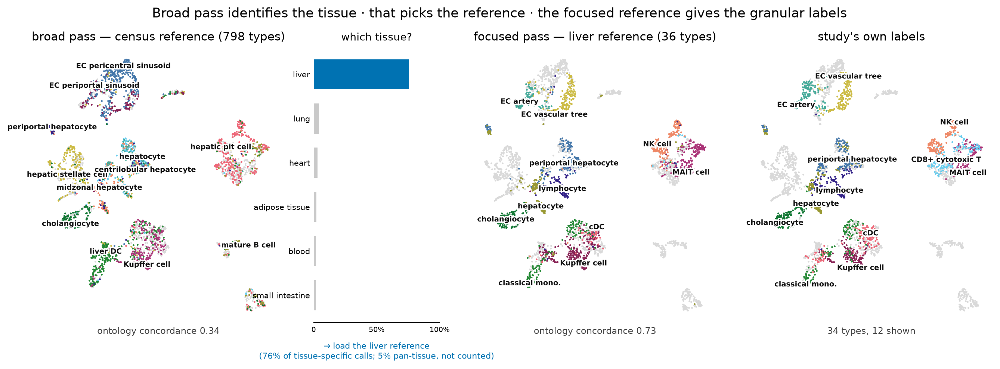

# A benchmark of cell-type annotation methods for single-cell data: cost, not accuracy, distinguishes them

*Condensed version. The extended report carries the full protocols and per-dataset
results.*

## Abstract

Cell-type annotation by reference mapping is among the most frequently repeated operations in
single-cell analysis, yet published comparisons report accuracy far more often than the
wall-clock time and memory that decide what a working scientist can actually run. We
benchmarked **thirteen methods** — classical, regularized-linear, parameter-free, correlation,
deep-probabilistic, prototype-VAE and foundation-model — across **six datasets** (8–86 cell
types; within-dataset, cross-dataset and cross-study splits) on commodity hardware, and
validated externally on Open Problems `label_projection`, whose datasets, metrics and ranking
we did not choose. Accuracy among the leading methods is tightly clustered — the top four span
**0.008** — while their inference cost differs by two orders of magnitude and their peak memory
by 2.5×. No method leads everywhere, and neither ordering is stable: accuracy inverts as the
reference grows from 3k cells to a full atlas, and cost rankings invert with the input feature
budget. Because several methods are now both accurate and cheap, the useful question is not
which is best but which fits a given job. We show that a low, flat inference cost makes
multi-stage annotation practical on a laptop, using **actinn-jax**, a JAX reimplementation of
ACTINN with a cached train-once/map-many reference: a shipped ~800-type reference with
calibrated abstention hands off to a user's own focused reference (cross-study liver
0.23/0.58 → 0.72/0.86, exact/ontology), with resolution below the cell-type label and
cluster-level novelty screening. The same profile annotates a whole 525,000-cell atlas in
41 s, three to four times faster than a tuned linear pipeline on the same query axis. The same route builds a pan-mouse reference with no GPU, and
distills **Pan-human Azimuth** into a broad-pass model matching its concordance at 6–9× its
throughput. We release the reimplementation, the harness and the pre-trained references.

## Key Points

- Among leading annotation methods, accuracy differences are small (top four within 0.008)
 while predict time differs by ~205× and peak memory by 2.5×; cost, not accuracy, is what
 distinguishes them in practice.
- Rankings are not stable: a prototype VAE moves from worst to best as the reference grows
 from 3k to 49k cells, and a tuned linear pipeline that fits 7× faster than a gene-space MLP
 on one panel costs 2.7× more on another with a narrower feature budget.
- Inference time is flat in reference size and cardinality for a cached gene-space MLP
 (0.08–0.33 s from 1k to 24k reference cells), which is what makes chaining several
 annotation stages practical on a laptop.
- A pretrained pan-human annotator can be distilled into a fast reference using only raw
 counts — no GPU, no labels — matching the teacher's concordance and beating a census-built
 reference, at 6–9× the teacher's throughput.
- Zero-shot foundation-model labels remain the weakest option in both our benchmark and the
 external one; their value is in learned structure, not in their label heads.

## Introduction

Annotating cells by mapping to a labeled reference is run constantly and rarely reported as a
cost. Existing comparisons [Abdelaal 2019, Fu 2024] emphasize accuracy; the axis that decides
what runs on a laptop — wall-clock and memory without a GPU — is usually absent. Foundation
models [Kalfon 2025] raise accuracy in some settings but need accelerators, and their
zero-shot label predictions underperform small models trained on curated references.

Concurrent work sharpens the question rather than settling it. **Pan-human Azimuth**
[Sarkar et al. 2026] ships a supervised hierarchical classifier over a harmonized
organism-wide typology — 8 levels, 382 leaf types, ~7M parameters over a fixed 5,055-gene
panel, trained on 9.7M curated cells, with abstention *learned* rather than thresholded
(expected calibration error 0.0044) — and runs on a laptop. It is better resourced than any
reference we could build, and its authors reach a conclusion parallel to ours: training-data
quality and organization matter as much as architecture or scale, with accuracy saturating
past ~5M training cells. A purpose-built pan-human model is therefore the right thing to
*start* from; the open question is what to do next, since no fixed typology can re-annotate
into a user's own label set or resolve states below its own leaves.

We therefore ask a practical question: for a given annotation job on commodity hardware,
which method should be run, and what does the surrounding workflow look like? The leading methods
now annotate quickly, accurately, and with a usable signal on unknown cells, so the shortage
is not another leaderboard but guidance on fit for purpose.

Because a benchmark written by a method's own author has a known failure mode, the comparison
was constrained by construction: every method runs on **every** dataset through one harness on
identical splits; the panel was chosen to include the baselines most likely to beat a small
MLP, and each of them does beat it somewhere; our own classical tier is left untuned while the
linear baseline is tuned; and the external validation uses a benchmark designed by others.

## Materials and methods

**actinn-jax.** A dependency-light JAX reimplementation of ACTINN [Ma & Pellegrini 2020] — a
4-layer network (100/50/25 hidden units, ReLU, softmax, Adam) — replacing TensorFlow-1.x
graph/session code that no longer installs on current Python and ML environments. Preprocessing is
sparse-aware; a fitted reference is cached and reused across queries; prediction is chunked
for atlas-scale inputs. Accuracy matches the original within repeat noise.

**Panel and datasets.** Thirteen methods (Supplementary Table S1) across six datasets
(Supplementary Table S2): lung within-dataset and cross-dataset, liver within-dataset and
cross-**study**, an 86-type blood+gut set, and PBMC — 8 to 86 cell types, spanning three
generalization regimes.

**Metrics.** Accuracy, macro-F1, and **ontology-aware concordance**, which credits a call that
is the same node, an ancestor or a descendant of the truth in the Cell Ontology. The last is
required because vocabularies disagree about granularity: on our cross-dataset lung split
reference and query share only 20 of 46 type names, so exact-match accuracy (~0.35 for every method)
measures vocabulary mismatch rather than transfer. Concordance is reported only where both
sides carry ontology ids.

**Execution.** Each method runs in its own environment as a separate process, because the
dependency sets are mutually unsatisfiable; one driver builds each split once from a fixed
seed and hands the identical pair to every method. Three repeats. Hardware: Apple Silicon,
CPU for classical/linear/correlation tiers, Apple MPS for deep and foundation tiers.
External validation runs on AWS `r7i.8xlarge` through Open Problems' own Nextflow pipeline.
Because wall-clock on a shared machine depends on co-scheduled load, external cost is
reported as a ratio to a method present in every run. Environments are pinned and the Cell
Ontology release is recorded.

**Supplementary material** (separate document) contains Figures S1–S4 — confusion matrices
with ontology-equivalent errors outlined, and per-class recall for eleven methods on three
splits — and Tables S1–S3.

**Workflow components.** A broad reference built from the CELLxGENE Census [CZI Census 2025];
a coarse→fine hierarchy obtained either from foundation-model embeddings or from Cell Ontology
lineage; confidence-threshold abstention calibrated per reference by withholding 10% of cell
types; masking-based refinement to a query's own supported classes or to a tissue; and a
cluster-level novelty screen. Protocols for each are documented in the benchmark
repository.

## Results

### Accuracy is clustered; cost is not

The top of the accuracy table is a four-way cluster spanning **0.008**, led by a tuned linear
pipeline rather than by a deep model (Table 1). Those same four methods differ by **~205× in
predict time** (0.33 s to 67 s) and **2.5× in peak memory**. Order within the cluster is not a
result — the stochastic methods move by more than 0.008 between identical reruns, scANVI by up
to 0.056 — so the four are best read as tied on accuracy and separated by cost. actinn-jax
holds the best ontology-aware concordance (0.811), likewise a margin inside repeat noise.

| method | acc | macro-F1 | ontology | fit (s) | predict (s) | peak mem (MB) |
|---|---:|---:|---:|---:|---:|---:|
| **linear-anova-pca** | **0.839** | 0.699 | 0.808 | **3.4** | **0.33** | 4386 |
| scArches | 0.833 | **0.701** | 0.804 | 48.7 | 17.2 | 1773 |
| scANVI | 0.832 | 0.698 | 0.808 | 0.0* | 66.7 | 2087 |
| **actinn-jax** | 0.831 | 0.683 | **0.811** | 24.2 | **0.54** | 2391 |
| CellTypist | 0.823 | 0.690 | 0.805 | 54.4 | **0.61** | 1569 |
| SVM | 0.808 | 0.675 | 0.796 | 55.2 | **0.07** | 1419 |
| ProtoCloud | 0.790 | 0.649 | 0.778 | 221.5 | 2.07 | 1907 |
| SingleR | 0.770 | 0.652 | 0.750 | 0.3 | 48.2 | 3612 |
| kNN | 0.770 | 0.623 | 0.768 | 0.4 | **0.19** | 1483 |
| scTOP | 0.739 | 0.619 | 0.703 | 1.1 | 1.21 | 1926 |
| scmap-cluster | 0.646 | 0.550 | 0.771 | 0.3 | 9.30 | 8609 |

**Table 1.** Accuracy and cost. Accuracy is the mean over the five shared-vocabulary
datasets, macro-F1 over all six, and ontology concordance over the four that carry Cell
Ontology ids; bold marks the best value in a column. *scANVI does most of its work in one train+predict pass, attributed to predict.
Per-dataset scores: Supplementary Table S3.

No method leads everywhere. The linear pipeline and ProtoCloud each take two datasets,
actinn-jax and scArches one apiece; actinn-jax leads the cross-study split, the regime closest
to real reference mapping. The spread across leading methods on any one dataset is 1–4 points.

### Rankings invert with reference size and with feature budget

Scaling the reference from 3k to 49k cells reverses the order: **ProtoCloud moves from worst
(0.722) to best (0.976)**, clear of actinn-jax (0.936) and the linear pipeline (0.939), at 19×
the CPU fit cost (Figure 1A). The HLiCA liver atlas reproduces the reversal independently
(Figure 1B), and peak memory stays within a bounded band rather than widening (Figure 1C).
Conclusions from subsampled references do not transfer to atlas scale in either direction.

**Figure 1.** Accuracy and peak memory against reference size, four methods carried to atlas
scale. *A:* lung, 3k → 49k reference cells. *B:* the HLiCA liver atlas, an independent
replication. *C:* peak memory over both sweeps.

External validation inverts a different axis. On Open Problems — datasets, metrics and ranking
not ours — all eleven methods were run in a single execution of its pipeline (Table 2). The
tuned linear pipeline places third on accuracy and costs **2.7× more** than actinn-jax, having
fit **7× faster** on our own panel. Open Problems supplies every method 1,000 highly variable
genes, and an ANOVA→PCA→logistic pipeline pays for the decomposition on every query whereas a
gene-space MLP amortizes it into a single fit. Neither a cost ranking nor an accuracy ranking
survives a change of feature budget.

| method | acc | macro-F1 | cost | peak mem |
|---|---:|---:|---:|---:|
| mlp | 0.843 | 0.662 | 1.98× | 19.9 GB |
| **actinn-jax** | 0.836 | 0.663 | 1.00× | 21.0 GB |
| **linear-anova-pca** | 0.828 | 0.647 | 2.67× | 20.1 GB |
| **SVM (SGD)** | 0.816 | 0.652 | 6.07× | 20.1 GB |
| logistic_regression | 0.813 | **0.689** | **0.18×** | 20.0 GB |
| **CellTypist** | 0.810 | 0.643 | 7.62× | 20.1 GB |
| knn | 0.793 | 0.648 | **0.07×** | 19.5 GB |
| xgboost | 0.791 | 0.614 | 5.48× | 80.7 GB |
| cellmapper_linear | 0.776 | 0.553 | 0.35× | 31.5 GB |
| naive_bayes | 0.738 | 0.613 | 0.19× | 19.5 GB |
| **scTOP** | 0.581 | 0.462 | **0.16×** | 20.4 GB |

**Table 2.** External validation on Open Problems `label_projection`, ordered by accuracy.
Bold marks components we contributed to that benchmark. *cost* is per-dataset wall-clock
relative to actinn-jax on the same instance. scTOP's mean reflects two collapses and one weak
result inside three ordinary ones, traced to the fixed feature budget.

### Inference cost is flat in reference size

Fit time grows with reference size and cardinality for every trained method. Prediction
does not: for a cached reference model it stays **0.08–0.33 s whether the reference holds 1k
or 24k cells, and 5 or 86 types** (Figure 2). With train-once/map-many caching the fit is paid
once and only the flat prediction cost recurs — the regime that matters when one reference
serves many queries. Peak memory is likewise bounded rather than divergent: the
linear/actinn-jax ratio holds at ~2–3× (6.1 vs 13.2 GB at 49k cells) rather than widening
(Figure 1C). The query axis behaves differently: with the reference fixed, actinn-jax
annotates the entire 524,699-cell liver atlas in **41 s**, three to four times faster than
the tuned linear pipeline's 126 s. Flatness does not carry to this axis, though — actinn-jax
loses 31% of its throughput across a tenfold growth in query (18,400 → 12,800 cells/s) while
the linear pipeline holds flat at ~4,200, narrowing the advantage from 4.2× to 3.1×. Peak
memory does not separate them there at all: on that axis it measures holding the query
rather than running the method.

**Figure 2.** Fit and prediction time against reference size and label cardinality. Fit time
grows for every trained method; prediction stays flat and sub-second across the whole range.

### A flat cost profile makes multi-stage annotation practical

Because each stage is a cached model with sub-second, memory-bounded inference, several can be
chained on a laptop (Figure 3). A shipped ~800-type census reference gives any query a
first-pass annotation with calibrated abstention; a small focused reference then re-annotates
at full resolution. On withheld cross-study liver cells the broad pass scores **0.23 exact /
0.58 ontology** and the focused reference reaches **0.72 / 0.86** on the same cells.

The two passes hand off; they do not combine. Substituting a stronger broad model lifts the
broad call but changes nothing downstream, and using it to narrow the focused pass's classes
makes the result **worse** (0.731 → 0.708), because a wrong mask discards the correct class
outright. Once the focused reference covers the tissue, the broad model's value is routing,
not resolution.

**Figure 3.** The workflow on a withheld liver study (3,396 cells), same embedding
throughout. The census reference spreads 137 of its 798 labels over the query (concordance
0.34); resolving those calls to tissue gives **76% liver** against 4% for the next candidate,
which selects the reference to load; the 36-type liver reference then re-annotates the same
cells at **0.73**, tracking the clusters. Rightmost panel is the study's own labels.

### A pretrained annotator can be distilled without a GPU or labels

Building the broad pass from the census requires a foundation model on a GPU to discover its
hierarchy. A pretrained pan-human annotator [Sarkar et al. 2026] already publishes one, so
labeling a corpus with it and training on those labels transfers both vocabulary and
structure — using **only raw counts**. On withheld cross-study liver cells the distilled model
**matches the teacher and beats the census-built reference**, at several times the teacher's
throughput, in under ten minutes of CPU (Table 3).

| broad-pass model | classes | ontology | cells/s |
|------------------------------|------:|------:|--------:|
| census-built, ours | 798 | 0.338 | 2,962 |
| Pan-human Azimuth (teacher) | 382 | 0.380 | 1,076–1,563 |
| **distilled from Azimuth, ours** | 324 | **0.406** | **8,937–10,021** |

**Table 3.** Broad-pass entry points on 3,396 withheld cross-study liver cells. The distilled
student needs only raw human counts to build — no GPU, no labeled input — and inherits the
teacher's vocabulary and hierarchy. It does not inherit the teacher's calibrated abstention,
which remains a limitation. The 0.406/0.380 ordering is one query, and both actinn-jax models
draw on a census sample that may include these studies while Azimuth does not, so read the
student as level with its teacher rather than ahead of it.

The GPU can be removed from the other route as well. Deriving the coarse hierarchy from Cell
Ontology lineage rather than from a foundation-model embedding beats both no hierarchy at all
(0.616 vs 0.547) and a same-sized random grouping (0.539), so it is the lineage structure and
not the mere act of splitting that helps. Being species-independent, that route also reaches a
second organism: a pan-mouse reference of 453 types across 85 tissues reaches 0.638 ontology
concordance on two withheld datasets after 17 s of CPU.

### Abstention is tunable; zero-shot labels are not competitive

Withholding 9 of 36 cell types entirely and sweeping a confidence threshold over the eight
methods that return a per-cell confidence, five trade coverage for accuracy across the range
and three do not: CellTypist's probabilities are saturated and give one operating point
instead of a curve, scTOP's projection score keeps only 6% of the query at p ≥ 0.5, and
ProtoCloud's ambiguity flag is flat until 0.9. Among the five that work, abstain quality does
not separate them — actinn-jax and scArches are effectively tied (0.969 accuracy on 66% of
cells with 73% of novel cells flagged, against 0.983 on 61% with 71%) — but cost does, at
0.67 s of predict time against 21.4 s. Separately,
a foundation model run zero-shot scored **0.201** ontology concordance against 0.917 for a
reference-trained model on the same cells, taking ~280× longer — reproduced independently on
Open Problems, where zero-shot entries sit at the bottom of the leaderboard.

## Discussion

Across two independent benchmarks the same pattern holds: methods separated by less than a
percentage point of accuracy are separated by two orders of magnitude in cost, and neither
ordering is stable across reference size or feature budget. Reporting accuracy alone therefore
under-determines the choice of method, and reporting it from a single reference size can
invert the recommendation.

Two consequences follow. First, benchmark design should treat reference size and input budget
as axes rather than as fixed settings; our own results reverse along both. Second, once
several methods are accurate and cheap, the productive contribution is not a further ranking
but a characterization of fit — which is why we report accuracy-per-second and
accuracy-per-byte, and demonstrate what a low flat cost profile enables rather than arguing
from the accuracy column.

We are explicit about what is not ours. ProtoCloud provides uncertainty, attribution and a
retraining-based refinement path, and becomes the most accurate method at atlas scale. A
purpose-built pan-human annotator is better resourced than our census-built reference and we
make no claim to improve on its annotations; we distill it. What remains distinct is the
hand-off no fixed typology performs — re-annotation into a user's own label set, resolution
below a typology's leaves, and screening for what none of them claims — at a cost that keeps
every stage on the machine already on the desk.

The main limitations are that the cross-method comparison is human-only and single
hardware-family; that our classical tier is untuned while the linear baseline is tuned, which
biases against our own method; and that the distilled reference inherits a vocabulary but not
its teacher's calibrated abstention. Full limitations are in the extended report.
