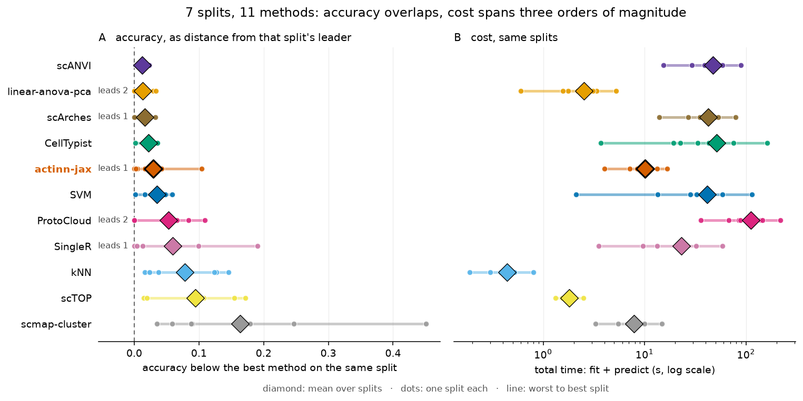
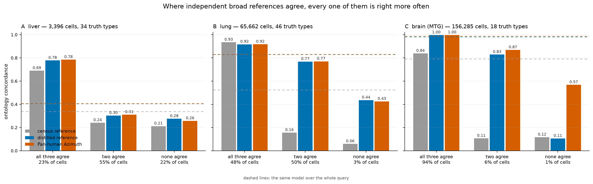

# A benchmark of cell-type annotation methods for single-cell data: cost, not accuracy, distinguishes them

*Condensed version. The extended report carries the full protocols, the per-dataset results,
and the scaling and abstention studies summarized here.*

## Abstract

Cell-type annotation by reference mapping is one of the most repeated operations in single-cell
analysis, yet comparisons report accuracy far more often than the time and memory that decide
what a scientist can actually run. We benchmarked **thirteen methods**, classical through
foundation-model, across **eight splits of seven datasets** (8–151 cell types) on commodity
hardware, and on Open Problems `label_projection`, whose datasets and metrics we did not
choose. Accuracy among the leading methods is tightly clustered — the top four span **0.008** —
while their inference cost differs by two orders of magnitude and their peak memory by 2.5×. No
method leads everywhere, and no ordering is stable: it inverts with reference size, feature
budget and label granularity. Because annotation is this cheap, a query can be labelled several
times rather than once. We ran three procedures that do so, all using **actinn-jax**, a JAX
reimplementation of ACTINN that caches a trained reference and labels a query in under a
second. A 798-type human reference assigns a tissue, and a tissue-specific reference then
relabels the same cells, raising cross-study liver from 0.23 exact / 0.58 ontology to 0.72 /
0.86. A pretrained pan-human annotator was distilled into an actinn-jax reference that matches
its accuracy and labels six to nine times faster, built from unlabelled data without a GPU.
Running three broad references over one query and grouping cells by whether the three agree
separates reliable calls from unreliable ones: in liver, lung and brain every reference scores
far higher where all three agree, though the consensus label beats no single reference. Code
and pre-trained references are available at github.com/iandriver/actinn-jax,
github.com/iandriver/actinn-jax-benchmark and doi:10.5281/zenodo.21688150.

## Key Points

- Among leading annotation methods, accuracy differences are small (top four within 0.008)
 while predict time differs by ~250× and peak memory by 2.4×.
- Rankings are not stable: a prototype VAE moves from worst to best as the reference grows
 from 3k to 49k cells, and a tuned linear pipeline that fits faster than a gene-space MLP on
 one panel costs 2.7× more on another with a narrower feature budget.
- Predict is sub-second for every CPU method tested and flat in reference size for all of
 them; what makes chaining stages practical is the ratio, a sub-second call recurring against
 a fit of 19–123 s paid once.
- A pretrained pan-human annotator was distilled into an actinn-jax reference that matches
 its concordance at 6–9× the throughput and beats a census-built reference. The distillation
 used unlabelled data and no GPU.
- Running three independent broad references over one query and grouping cells by whether
 the three agree separates reliable calls from unreliable ones, in all three tissues tested:
 where the references concur, every one of them is far more accurate than where they do not.
 The agreeing set covers 23% to 94% of a query, tracking the resolution of that query's own
 annotation. A consensus *label* beats the best single reference in none of the three.

## Introduction

Annotating cells by mapping to a labeled reference is run constantly and rarely reported as a
cost. Existing comparisons [Abdelaal 2019, Fu 2024] emphasize accuracy; the axis that decides
what runs on a laptop — wall-clock and memory without a GPU — is usually absent. Foundation
models [Kalfon 2025] raise accuracy in some settings but need accelerators, and used zero-shot
they underperform far simpler alternatives, here (0.201 against 0.917 ontology concordance on
lung) and in an independent evaluation of scGPT and Geneformer embeddings [Kedzierska 2025].

That reporting gap matters more than a missing column, because annotation in practice is not
one decision. A working analysis asks what broad compartments are present, which tissue the
query resembles, how the cells resolve against a reference matched to that tissue, whether
anything is present that no reference describes, and how much of the answer to believe. Each
of those is a reference call. When a call costs minutes, the workflow collapses to a single
pass against a single reference chosen in advance; when it costs a fraction of a second,
running several references and comparing them becomes ordinary. The benchmark below is
therefore a means rather than an end: it establishes that the accuracy differences among the
leading methods are small and the cost differences are not, which is what licenses spending
the budget on more passes instead of on a better single pass.

Concurrent work sharpens the question rather than settling it. **Pan-human Azimuth**
[Sarkar et al. 2026] is a supervised hierarchical classifier over a harmonized
organism-wide typology — 8 levels, 382 leaf types, ~7M parameters over a fixed 5,055-gene
panel, trained on 9.7M curated cells, with abstention *learned* rather than thresholded
(expected calibration error 0.0044) — and runs on a laptop. It is better resourced than any
reference we could build, and its authors reach a conclusion parallel to ours: training-data
quality and organization matter as much as architecture or scale, with accuracy saturating
past ~5M training cells. A purpose-built pan-human model is therefore the right thing to
*start* from; the open question is what to do next, since no fixed typology can re-annotate
into a user's own label set or resolve states below its own leaves.

Because a benchmark written by a method's own author has a known failure mode, the comparison
was constrained by construction: every method runs on **every** dataset through one harness on
identical splits; the panel was chosen to include the baselines most likely to beat a small
MLP, and each of them does beat it somewhere; our own classical tier is left untuned while the
linear baseline is tuned; and the external validation uses a benchmark designed by others.

## Materials and methods

**actinn-jax.** A dependency-light JAX reimplementation of ACTINN [Ma & Pellegrini 2020] — a
4-layer network (100/50/25 hidden units, ReLU, softmax, Adam) — replacing TensorFlow-1.x
graph/session code that no longer installs on current Python and ML environments. Preprocessing is
sparse-aware; a fitted reference is cached and reused across queries; prediction is chunked
for atlas-scale inputs. Accuracy matches the original within repeat noise.

**Panel and datasets.** Thirteen methods (Supplementary Table S1) across eight splits of seven
datasets (Supplementary Table S2): lung within-dataset and cross-dataset, liver within-dataset
and cross-**study**, an 86-type blood+gut set, PBMC, and Allen middle temporal gyrus nuclei at
two levels of one taxonomy — 8 to 151 cell types, spanning three generalization regimes.

**Metrics.** Accuracy, macro-F1, and **ontology-aware concordance**, which credits a call that
is the same node, an ancestor or a descendant of the truth in the Cell Ontology. The last is
required because vocabularies disagree about granularity: on our cross-dataset lung split
reference and query share only 20 of 46 type names, so exact-match accuracy (~0.35 for every method)
measures vocabulary mismatch rather than transfer. Concordance is reported only where both
sides carry ontology ids.

**Agreement between references.** Three broad annotators answer in three different
vocabularies, so agreement is defined in the Cell Ontology, where all three map: two calls
agree when they are the same term or one is an ancestor of the other — the same relation the
concordance metric uses. Cells are partitioned by how many of the three mutually agree.

**Execution.** Each method runs in its own environment as a separate process, because the
dependency sets are mutually unsatisfiable; one driver builds each split once from a fixed
seed and hands the identical pair to every method. Three repeats. Hardware: Apple Silicon,
CPU for classical/linear/correlation tiers, Apple MPS for deep and foundation tiers.
External validation runs on AWS `r7i.8xlarge` through Open Problems' own Nextflow pipeline.
Because wall-clock on a shared machine depends on co-scheduled load, cost is reported from the
fastest of three runs on an otherwise idle machine, and external cost as a ratio to a method
present in every run. Environments are pinned and the Cell Ontology release is recorded.

**Supplementary material** (separate document) carries the scaling studies (Figures S5–S7),
the abstention sweep (Figures S8–S9), confusion matrices and per-class recall (Figures S1–S4),
and Tables S1–S3.

**Workflow components.** A broad reference built from the CELLxGENE Census [CZI Census 2025];
a coarse→fine hierarchy obtained either from foundation-model embeddings or from Cell Ontology
lineage; confidence-threshold abstention calibrated per reference by withholding 10% of cell
types; masking-based refinement to a query's own supported classes or to a tissue; and a
cluster-level novelty screen. Protocols for each are documented in the benchmark
repository.

## Results

### Accuracy is clustered; cost is not

The top of the accuracy table is a four-way cluster spanning **0.008**, led by a tuned linear
pipeline rather than by a deep model (Table 1; Figure 1 draws the whole panel at once). Those
same four differ by **~250× in predict time** (0.24 s to 58.7 s) and **2.4× in peak memory**.
Order within the cluster is not a result: the stochastic methods move by more than 0.008
between identical reruns, scArches by up to 0.024, so the four are best read as tied on
accuracy and separated by cost. actinn-jax and scANVI share the best ontology-aware
concordance (0.811).

**Figure 1.** Eleven methods over seven splits. *A:* accuracy as the gap to whichever method
leads that split — raw accuracy is dominated by split difficulty (0.94 on pbmc against 0.36 on
cross-dataset lung), so a range over it would measure the datasets rather than the methods;
`leads N` counts splits won. *B:* fit + predict on the same splits. Diamonds are means, dots
the individual splits, lines run worst to best. Six methods sit within **0.035** of the
per-split leader while spanning 3.4 s to 57 s. Every method's spread across splits is wider
than the distance between the leading methods, which is the caution that belongs with any
panel-mean ranking. Repeat-to-repeat variation is far smaller — five methods are exactly
deterministic, and only scArches (0.024), SVM (0.023) and scANVI (0.015) move more than 0.012 — so the
range drawn here is across datasets. Per-split detail: Supplementary Figure S11.

| method | acc | macro-F1 | ontology | fit (s) | predict (s) | peak mem (MB) |
|---|---:|---:|---:|---:|---:|---:|
| **linear-anova-pca** | **0.839** | 0.699 | 0.808 | **2.5** | **0.31** | 4341 |
| scANVI | 0.836 | **0.703** | **0.811** | 0.0* | 58.7 | 2079 |
| scArches | 0.831 | 0.698 | 0.807 | 37.9 | 11.9 | 1774 |
| **actinn-jax** | 0.831 | 0.683 | **0.811** | 10.3 | **0.24** | 2407 |
| CellTypist | 0.823 | 0.690 | 0.805 | 44.0 | **0.52** | 1569 |
| SVM | 0.806 | 0.675 | 0.794 | 40.5 | **0.06** | 1416 |
| **ProtoCloud** | 0.790 | 0.649 | 0.778 | 118.6 | 1.32 | 1888 |
| SingleR | 0.770 | 0.652 | 0.750 | 0.2 | 34.7 | 3623 |
| kNN | 0.769 | 0.622 | 0.768 | 0.3 | **0.14** | 1489 |
| **scTOP** | 0.739 | 0.619 | 0.703 | 0.9 | 0.98 | 1927 |
| scmap-cluster | 0.646 | 0.550 | 0.771 | 0.2 | 7.33 | 8637 |

**Table 1.** Accuracy and cost. Accuracy is the mean over the five shared-vocabulary
datasets, macro-F1 over all six, and ontology concordance over the four that carry Cell
Ontology ids; bold marks the best value in a column. The two brain splits are held out of
these means — they were measured after this pass — and reported per dataset instead;
including both would move actinn-jax from fourth to fifth, behind CellTypist. *scANVI does most of its work in one train+predict pass, attributed to predict.
Per-dataset scores: Supplementary Table S3.

Neither ordering is stable. Carrying four methods from a 3k-cell reference to a full atlas
reverses the accuracy ranking — a prototype VAE moves from worst to best — and the external
Open Problems panel, whose 1,000-gene budget is narrower than ours, reverses the cost ranking,
with the tuned linear pipeline costing 2.7× more than it does here (Supplementary Figure S6,
and the extended report).

Granularity moves it too, and against us. The same Allen middle temporal gyrus nuclei scored at
two levels of one taxonomy behave like two different benchmarks: at Allen's 24 subclasses ten
of the eleven methods land within 0.017 of each other, and at the 151 cell sets the taxonomy
enumerates the ranking inverts — SingleR, eighth overall, leads at **0.845**, while actinn-jax
falls to tenth at **0.741**. Correlation-to-centroid methods gain exactly where the trained
classifiers lose, helped by the fact that cluster-level labels are themselves the output of
clustering the same expression space. One split is a signal, not a characterization, but it is
the one split in this panel at the resolution a cortical taxonomy actually works at.

A foundation model run zero-shot scored **0.201** ontology concordance against 0.917 for a
reference-trained model on the same cells, taking ~280× longer. Open Problems reproduces that
independently: its zero-shot entries sit at the bottom of the leaderboard, and actinn-jax
places 3rd of 17 on accuracy there, 1st among methods that complete every dataset.

Prediction is where the annotation budget is actually spent, and it is small: sub-second for
every CPU method tested, and flat in reference size for all of them, since a cached model's
inference does not depend on how many cells trained it. What makes chaining stages practical
is therefore not a uniquely flat predict but the ratio — a sub-second call recurring against a
fit of 19–123 s that is paid once (Supplementary Figure S7). With the reference held fixed,
annotating a whole 525,000-cell atlas takes **31 s** (Supplementary Figure S8).

### One query, two passes: routing and then resolution

That budget buys a workflow rather than a call (Figure 2). A ~800-type census
reference annotates any query without being told what tissue it is; resolving those calls
through the reference's per-class tissue map identifies the tissue; a small focused reference
for that tissue then re-annotates the same cells at full resolution. On withheld cross-study
liver cells the broad pass scores **0.23 exact / 0.58 ontology** and the focused reference
reaches **0.72 / 0.86**.

The two passes hand off. Substituting a stronger broad model lifts the
broad call but changes nothing downstream, and using it to narrow the focused pass's classes
makes the result **worse** (0.731 → 0.708), because a wrong mask discards the correct class
outright. Once the focused reference covers the tissue, the broad model's value is routing,
not resolution.

**Figure 2.** The workflow on a withheld liver study (3,396 cells), same embedding
throughout. The census reference spreads 144 of its 798 labels over the query (concordance
0.34); resolving those calls to tissue gives **76% liver** against 4% for the next candidate,
which selects the reference to load; the 36-type liver reference then re-annotates the same
cells at **0.73**, tracking the clusters. Rightmost panel is the study's own labels.

### The broad entry point is interchangeable, and one can be distilled without a GPU

Building a broad reference from the census requires a foundation model on a GPU to discover
its hierarchy. A pretrained pan-human annotator [Sarkar et al. 2026] already publishes one, so
labeling a corpus with it and training on those labels transfers both vocabulary and
structure — using **only raw counts**, no GPU and no labeled input, in under ten minutes of
CPU. The result matches its teacher and beats our census-built reference, at six to nine times
the teacher's throughput (Table 2).

| broad-pass model | classes | ontology | cells/s |
|------------------------------|------:|------:|--------:|
| census-built, ours | 798 | 0.338 | 2,962 |
| Pan-human Azimuth (teacher) | 382 | **0.408** | 1,076–1,563 |
| **distilled from Azimuth, ours** | 324 | 0.406 | **8,937–10,021** |

**Table 2.** Broad-pass entry points on 3,396 withheld cross-study liver cells, all three
scored on identical cells through one script. The distilled student needs only raw human
counts to build and inherits the teacher's vocabulary and hierarchy. It does not inherit the
teacher's calibrated abstention, which remains a limitation. Student and teacher are level
here rather than separated: read the distillation as preserving the teacher's annotations at a
fraction of its cost, not as improving on them.

The GPU can be removed from the census route as well. Deriving the coarse hierarchy from Cell
Ontology lineage rather than from a foundation-model embedding beats both no hierarchy at all
(0.616 vs 0.547) and a same-sized random grouping (0.539), so it is the lineage structure and
not the mere act of splitting that helps. Being species-independent, that route also reaches a
second organism: a pan-mouse reference of 453 types across 85 tissues reaches 0.638 ontology
concordance on two withheld datasets after 17 s of CPU.

### Where independent references agree, all of them are right more often

The three entry points are interchangeable, so we ran all of them over the same query. Scored
on identical cells and compared in the Cell Ontology, they partition each query by agreement
(Figure 3). We ran this on three tissues:
withheld cross-study **liver** (3,396 cells, 34 truth types), the Krasnow **lung** atlas
(65,662 cells, 46 types), and the Allen human **middle temporal gyrus** (156,285 cells, 18
types).

One result holds everywhere. Cells on which the references disagree are annotated far less
reliably than cells on which they concur, for every reference and in every tissue: the census
model falls from 0.690 to 0.212 across the liver partition, 0.934 to 0.059 across lung, and
0.839 to 0.117 across brain, with the same direction for the other two. Because all three
improve together, agreement is selecting cells that are unambiguous rather than cells that one
model happens to get right — and unlike accuracy it is computable on a query whose answers are
unknown, for three sub-second calls and no labels.

What varies, and varies enormously, is how much of a query the agreeing set covers: **23% on
liver, 48% on lung, 94% on brain**. The brain figure is the instructive one. That query's Cell
Ontology annotation uses 18 terms for a region whose own working taxonomy, `CCN201908210`,
defines 154 cell sets, and 55% of its cells fall in a single class. High agreement there
reflects a coarse truth vocabulary rather than an easy tissue, and it shows the partition
reporting the resolution of the annotation it is scored against — which is a property of the
query, not of the method.

A consensus *label* is not the prize in any of the three. Taking the most specific call the
agreeing references support scores 0.365 on liver against the best single reference's 0.408,
0.828 on lung against 0.831, and 0.837 on brain against 0.987 — the last badly worse, because
choosing the deepest agreeing call lets one reference's confident, lineage-compatible but
wrong specificity override two correct coarser calls. Running several references does not
produce a better annotation; it tells you which annotations to trust.

Agreement is defined by the Cell Ontology, and the comparison was
possible only because all three references carry Cell Ontology terms. The Common Cell type
Nomenclature [Miller 2020] answers the same problem differently, giving each taxonomy's cell
sets stable accessions and a curated alias layer rather than a shared coordinate system. The
two are complements, not substitutes: in the published human MTG taxonomy `CCN201908210` the
154 cell sets carry an anatomical tag but no cell-type ontology id, and the field that matches
cell sets across taxonomies is filled for 23 of them. CL supplies the *total* subsumption
relation that makes an agreement partition computable; CCN supplies the provenance CL cannot,
recording which taxonomy and publication each label came from. A workflow that compares
annotations across references wants both.

**Figure 3.** Ontology concordance within each agreement tier for three broad references, on
withheld cross-study liver (*A*), the Krasnow lung atlas (*B*) and the Allen human middle
temporal gyrus (*C*); dashed lines are the same models over the whole query. Agreement is
evaluated in the Cell Ontology because the three references answer in different vocabularies
(798, 382 and 324 classes). The ordering is the same in all three tissues; the fraction of
cells on which the references agree is not, and tracks how finely the query's own annotation
is resolved.

### Abstention flags the cells a reference does not cover

Withholding 9 of 36 cell types entirely and sweeping a confidence threshold over the eight
methods that return a per-cell confidence, five trade coverage for accuracy across the range
and three do not: CellTypist's probabilities are saturated and give one operating point
instead of a curve, scTOP's projection score keeps only 6% of the query at p ≥ 0.5, and
ProtoCloud's ambiguity flag is flat until 0.9 (Supplementary Figures S8–S9). Among the five
that work, abstain quality does not separate them — actinn-jax and scArches are effectively
tied (0.969 accuracy on 66% of cells with 73% of novel cells flagged, against 0.983 on 61%
with 71%) — but cost does, at 0.24 s of predict time against 11.9 s. This is a second and
complementary route to the same end as reference agreement: a calibrated threshold within one
reference, or concurrence across several with no calibration at all.

## Discussion

Across two independent benchmarks the same pattern holds: methods separated by less than a
percentage point of accuracy are separated by two orders of magnitude in cost, and neither
ordering is stable across reference size or feature budget. Reporting accuracy alone therefore
under-determines the choice of method, and reporting it from a single reference size can
invert the recommendation.

What a sub-second call changes is what an annotation pipeline can afford to do. It can be a
sequence of cheap calls rather than one classification: route the query to a tissue,
re-annotate against a reference matched to it, resolve states below the label, and run several
independent references to see where they agree. None of those steps needs a more accurate
classifier than the ones benchmarked here; each needs a cheaper one.

The agreement result buys no better label — the consensus call loses to the best single
reference — but it identifies, with no ground truth, the fraction of a query on which
independent references concur and on which every one of them is markedly more often right.
Obtaining it costs three annotation runs instead of one, or a few seconds.

Several pieces of this come from elsewhere. ProtoCloud provides uncertainty, attribution and a
retraining-based refinement path, and is the most accurate method at atlas scale. A
purpose-built pan-human annotator is better resourced than our census-built reference, and the
distilled model matches it rather than improving on it, at six to nine times the throughput
and in the same vocabulary. What remains distinct is the hand-off
no fixed typology performs — re-annotation into a user's own label set, resolution below a
typology's leaves, and screening for what none of them claims — at a cost that keeps every
stage on the machine already on the desk.

The main limitations are that the cross-method comparison is human-only and single
hardware-family; that our classical tier is untuned while the linear baseline is tuned, which
biases against our own method; that the distilled reference inherits a vocabulary but not its
teacher's calibrated abstention; that the agreement result covers three tissues with three
references, so its direction is replicated but the size of the agreeing fraction is strongly
dependent on how finely the query is annotated; and that agreement is defined in the Cell
Ontology, whose subsumption judgments decide what counts as agreeing and whose resolution in
cortex is roughly a tenth of the working taxonomy's. Full limitations are in the extended
report.
