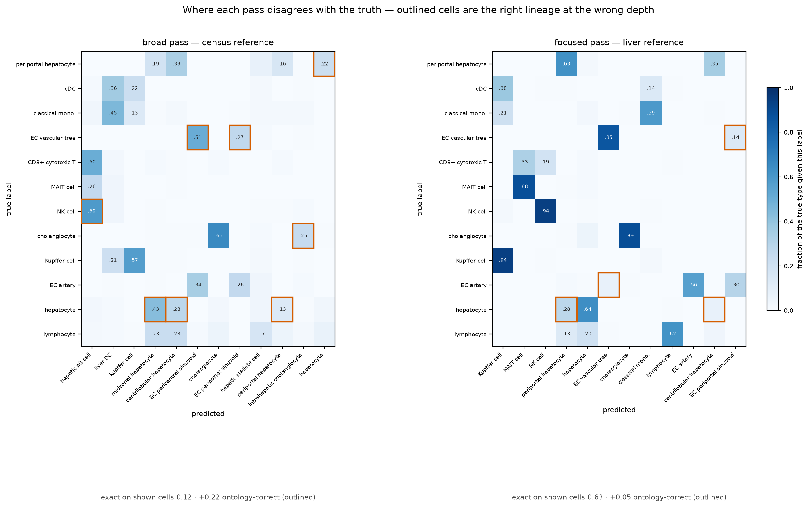
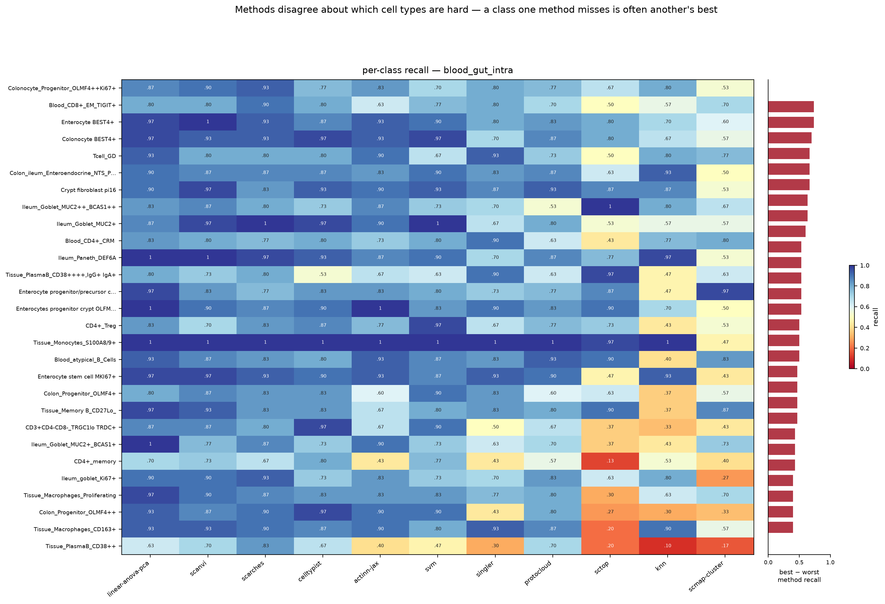
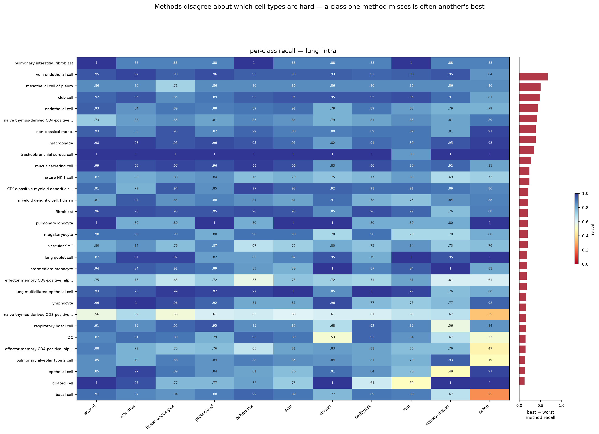
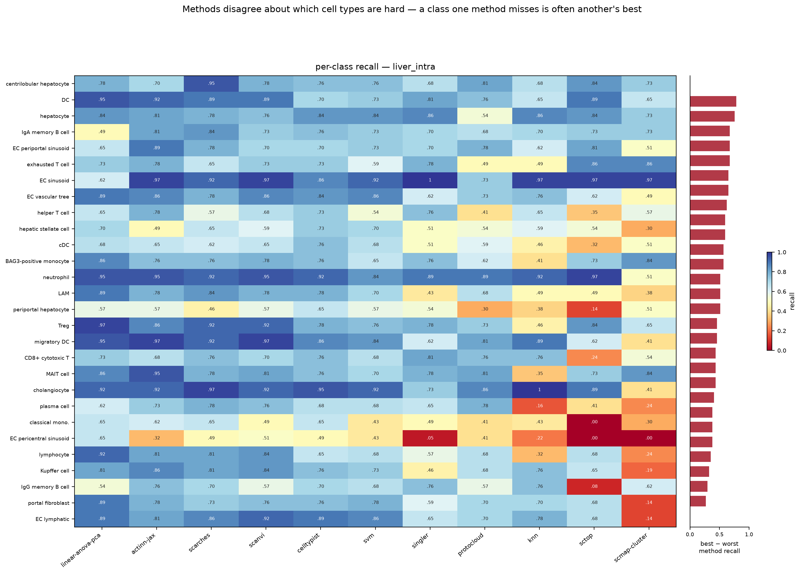
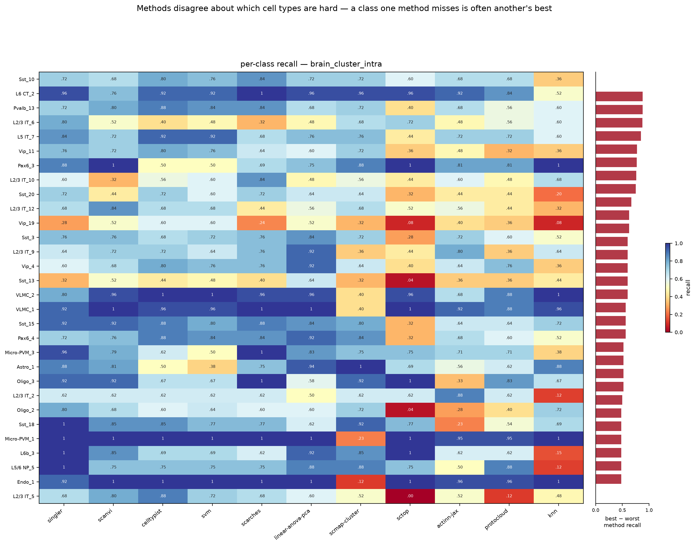
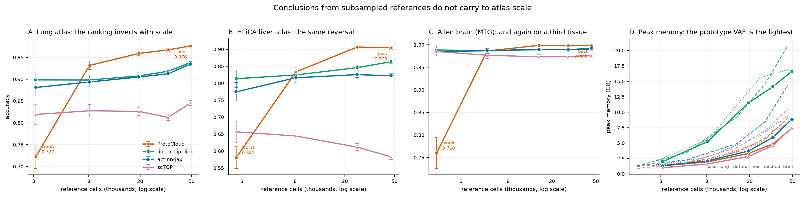
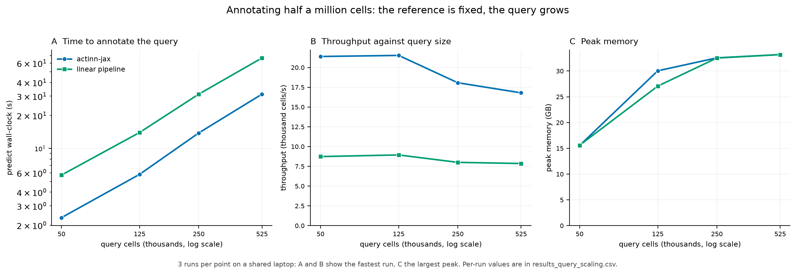
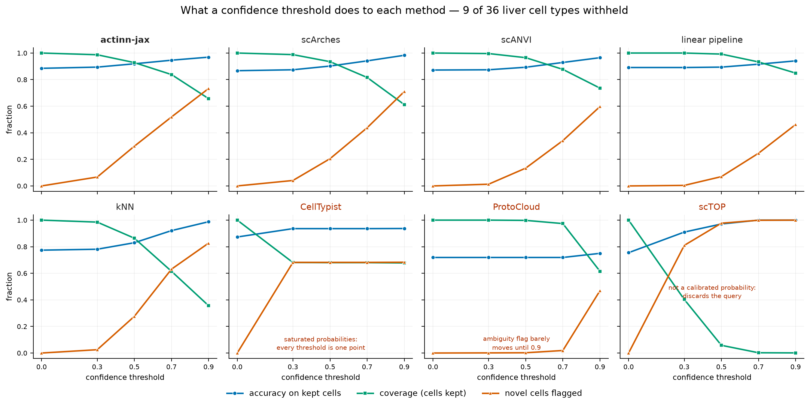
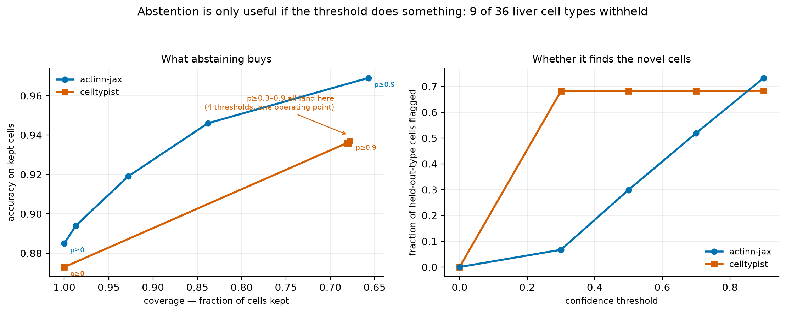
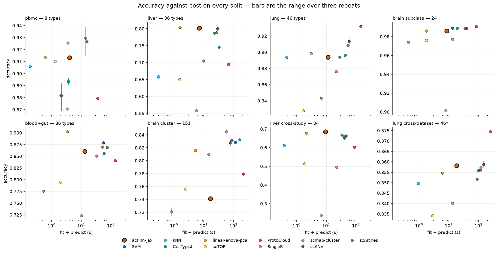

# Supplementary material

*Supplement to "A benchmark of cell-type annotation methods for single-cell data". Figures and tables referenced from
the main text as Supplementary Figure S1–S13 and Supplementary Table S1–S3.*

## Supplementary figures

**Figure S1.** Confusion matrices for the broad and focused passes on the withheld
cross-study liver query. Each cell is the fraction of a true type receiving that label;
outlined cells are off-diagonal calls that are an ancestor or descendant of the truth in the
Cell Ontology, i.e. error under exact match and credit under ontology-aware concordance. The
scores below each panel are means over the twelve truth types drawn, not over the whole
query, so they run lower than the query-wide figures quoted in the main text. The broad pass
scores 0.12 exact and recovers +0.22 through the ontology — its mistakes are the right lineage
at the wrong depth (hepatocyte → midzonal or centrilobular hepatocyte; NK cell → hepatic pit
cell, the Cell Ontology term for a liver NK cell). The focused pass scores 0.63 exact, +0.05:
it is already right most of the time, so the ontology has little left to recover.

**Figure S2.** Per-class recall for eleven methods on the 86-type blood+gut split, ordered by
how much the methods disagree (best minus worst recall, right-hand strip). The best and worst
method differ by a median of 0.30 recall per class and up to 0.73; mean pairwise Spearman
between methods' per-class recall is 0.58. Class size is not the explanation, and on this
split it cannot be: capping per label leaves **84 of the 86 classes holding exactly 30 test
cells**, with the remaining two at 29 and 14. There is no size variation left for rarity to
act through, so the disagreement is about which types a method finds hard, not how many
examples it saw.

**Figure S3.** Per-class recall on the 46-type lung split, drawn as in Figure S2. Methods
agree more here than on blood+gut: mean pairwise Spearman 0.65, median best-minus-worst 0.16.

**Figure S4.** Per-class recall on the 36-type liver split, drawn as in Figure S2. Mean
pairwise Spearman is 0.66, but the median best-minus-worst gap is 0.43 — the widest
disagreement of the three splits, and a reminder that a high rank correlation between methods
still leaves large per-class differences.

**Figure S5.** Per-class recall on the 151-type brain cluster split, drawn as in Figure S2.
This is the split where the panel's ranking inverts (§3.1): the two correlation methods,
weakest almost everywhere else, sit among the leaders, and actinn-jax is tenth of eleven.
Mean pairwise Spearman is 0.61 and the median best-minus-worst gap is 0.32, rising to 0.88.
The disagreement is concentrated in the graded families — `L2/3 IT`, `Sst`, `Vip` — where
neighbouring clusters differ by degree rather than by marker, and not in the rare classes:
capping at 100 cells per cluster leaves 130 of the 151 classes tied at 25 test cells.

## Supplementary tables

| method | source | tier | engine | rejection | runtime |
|-----------|------------|-----------|--------------------|----------|------------|
| **actinn-jax** | [Ma & Pellegrini 2020] | classical | JAX MLP | confidence threshold | JAX |
| SVM | [Pedregosa 2011] | classical | linear SVM (SGD) | — | scikit-learn |
| kNN | [Pedregosa 2011] | classical | k-nearest neighbors | — | scikit-learn |
| CellTypist | [Domínguez Conde 2022] | linear | L2 logistic regression | prob threshold | scikit-learn |
| **linear-anova-pca** | [Pedregosa 2011] † | linear | normalize → ANOVA → PCA(220) → logreg | prob | scikit-learn |
| **scTOP** | [Yampolskaya 2023] | parameter-free | rank z-score class-average projection | — | NumPy |
| SingleR | [Aran 2019] | correlation | Spearman + fine-tuning | — | R |
| scmap-cluster | [Kiselev 2018] | correlation | centroid cosine | yes (unassigned) | R |
| scANVI | [Xu 2021] | deep | scVI semi-supervised VAE | prob | scVI |
| scArches | [Lotfollahi 2022] | deep | scANVI reference surgery | prob | scVI |
| **ProtoCloud** | [Guo & Ding 2026] | deep | prototype VAE + LRP attribution | ambiguity flag | PyTorch |
| scPRINT | [Kalfon 2025] | foundation | pretrained transformer, zero-shot | — | PyTorch |
| **Pan-human Azimuth** | [Sarkar et al. 2026] | pretrained | 8-level hierarchical NN, fixed 382-leaf typology | trained `Unassigned` | TensorFlow |

**Table S1.** The benchmarked methods: model family (*tier*), the engine each one runs, whether
it can decline to call a cell (*rejection*), and the runtime stack it was run on. Bold marks
the methods added to this panel here.

† `linear-anova-pca` has no method paper: it is a baseline assembled here from scikit-learn
components, tuned deliberately to be the strongest simple competitor we could build.

| dataset | source | split | tissue | #types | genes | notes |
|-------------|----------|-------|-----------|------|-------|-----------|
| lung_intra | [Travaglini 2020] | within-dataset | lung (Krasnow) | 46 | Ensembl | 300 cells/type ref |
| lung_cross | [Sikkema 2023] → [Travaglini 2020] | cross-dataset | lung (HLCA → Krasnow) | 46 | Ensembl | different lab/protocol |
| liver_intra | [Edgar 2026] | within-dataset | liver (HLiCA) | 36 | Ensembl | 150 cells/type |
| liver_cross | [Edgar 2026] | cross-**study** | liver (HLiCA) | 34 | Ensembl | train 6 studies → test withheld study |
| blood_gut_intra | [Alegbe 2026] | within-dataset | blood + gut (IBDverse) | 86 | Ensembl | high cardinality; no CL ids |
| pbmc | [10x Genomics 2016] | within-dataset | PBMC (pbmc3k) | 8 | symbols | small-n; scPRINT skips (symbols) |
| brain_intra | [Jorstad 2023] | within-dataset | brain, MTG (Allen) | 24 | Ensembl | single nuclei; Allen subclasses |
| brain_cluster | [Jorstad 2023] | within-dataset | brain, MTG (Allen) | 151 | Ensembl | same nuclei, CCN cell sets |

**Table S2.** The eight benchmark splits over seven datasets. *split* separates within-dataset holdouts from
cross-dataset and cross-study transfer; *genes* records whether the matrix is keyed by
Ensembl ids or gene symbols. Brain is labelled with Allen's `Subclass` rather than with Cell
Ontology terms, which collapse its 24 subclasses to 18 (§2.3), so it carries no ontology
score.

| dataset | actinn-jax | best method (acc) |
|---|---|---|
| lung_intra (46 types) | 0.894 | ProtoCloud 0.932 |
| lung_cross (cross-dataset)† | 0.358 exact / 0.752 ontology | ProtoCloud 0.374 / **0.791 ontology** |
| liver_intra (36 types) | 0.802 | linear-anova-pca 0.804 |
| liver_cross (cross-study) | **0.686 exact / 0.731 ontology** | actinn-jax |
| blood_gut (86 types) | 0.860 | linear-anova-pca 0.902 |
| pbmc (8 types) | 0.913 | scArches 0.929 |
| brain, subclass (24 types) | 0.986 | ProtoCloud 0.991 |
| brain, cluster (151 types) | 0.741 | SingleR 0.845 |

**Table S3.** Per-dataset accuracy: actinn-jax against whichever method leads that dataset.
† on lung_cross the exact-match score is a vocabulary artifact, so ontology concordance is
the meaningful column.

## Cost and scaling

These studies establish the cost claims the main text summarizes in one paragraph each. They
are here rather than in the main text because the workflow argument depends on inference being
cheap, not on the shape of the curve that makes it cheap.

**Figure S6.** Accuracy and peak memory against reference size, four methods carried to atlas
scale on three tissues. *A:* lung, 3.1k → 49k reference cells. *B:* the HLiCA liver atlas,
2.7k → 47k. *C:* Allen brain (MTG), 1.8k → 46k. In each one a prototype VAE moves from worst to
best as the reference grows. *D:* peak memory over all three sweeps. Error bars on *A* and *B*
are 95% binomial intervals on the query, which grows with the reference (1,035 to 16,398 cells
on lung), so they narrow from left to right; each point is a single run.

**Figure S7.** Fit and predict time against reference size and label cardinality, for the six
CPU methods. Fit grows on both axes for every trained method, steeply for CellTypist and the
SVM. Predict is flat in reference size for all six, so that flatness is a property of cached
inference generally rather than of any one method; cardinality is the axis that separates them,
where actinn-jax rises 3.1× from 5 to 86 types against the tuned linear pipeline's 11.0×. SVM
and kNN predict faster than either throughout. scTOP's smallest-reference point carries
one-time import cost and is not a scaling effect.

**Figure S8.** Cost against query size — 50,000 to 524,699 cells — with the reference fixed at
17,753 cells; every query in the main accuracy panel is smaller than the leftmost point here.
*A:* wall-clock to annotate the query. *B:* throughput, which declines 21% for actinn-jax and
10% for the linear pipeline, narrowing the advantage from 2.4× to 2.1×. *C:* peak memory,
which does not distinguish them — on this axis it measures holding the query, not running the
method. Three runs per point on a shared laptop: *A* and *B* report the fastest run, since
contention can only add time, and *C* the largest peak, since resident-set size understates a
run the OS has partly evicted.

## Abstention

**Figure S9.** What a confidence threshold does to each of the eight methods that return a
per-cell confidence, with 9 of 36 cell types held out of the liver reference so 1,350 query
cells are out-of-distribution. Every quantity is a fraction, so all three share one axis. The
five that work share a shape — accuracy and novelty rising as coverage falls — and the three
that do not each fail visibly and differently.

**Figure S10.** The same sweep read as a trade-off, which is what compares methods to each other
rather than to themselves. *Left:* accuracy on kept cells against the fraction kept — the five
usable methods lie along one band, which is the basis for calling their abstain quality tied.
*Right:* the share of held-out-type cells flagged as the threshold rises.

## Per-split accuracy and cost

**Figure S11.** The data behind Figure 1 without the gap-to-leader normalization: accuracy
against fit + predict time on each of the eight splits, error bars the range over three
repeats on both axes. Axis limits are per panel, so vertical position compares methods within
a split and not across them — the splits differ by more than half an accuracy point end to
end (pbmc 0.87–0.94, cross-dataset lung 0.33–0.38†), which is why Figure 1 normalizes. Most
error bars are invisible because most methods are deterministic given a fixed split; the ones
that show are scArches, SVM and scANVI, whose repeats differ by up to 0.024, 0.023 and 0.015.
† cross-dataset lung exact-match accuracy is a label-vocabulary artefact (§3.1).

## Gene budget on the Open Problems panel

**Figure S12.** actinn-jax accuracy and macro-F1 against input gene budget across all six Open Problems
datasets. More genes help most datasets but regress the fine-grained,
domain-shifted tabula_sapiens.

**Figure S13.** Label-free signals for setting the gene budget without test labels. Held-out
reference cross-validation and query-cells-per-class both single out tabula_sapiens, the one
dataset where more genes cost real accuracy — about 10 points. hypomap drifts down as well,
but from a saturated 0.998, and neither signal flags it.
